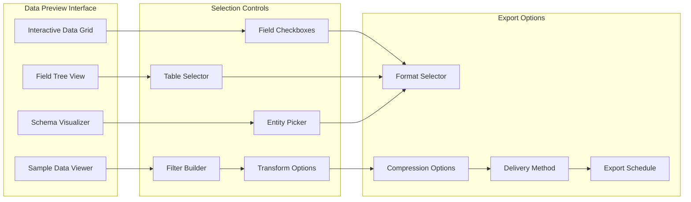
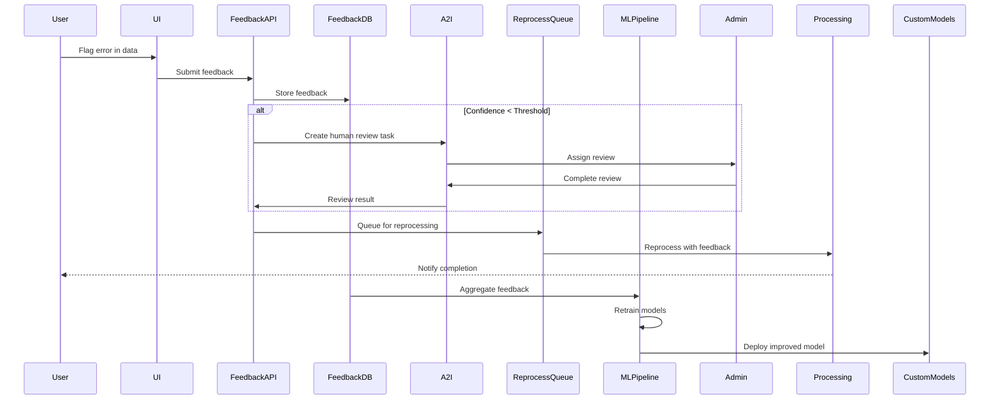
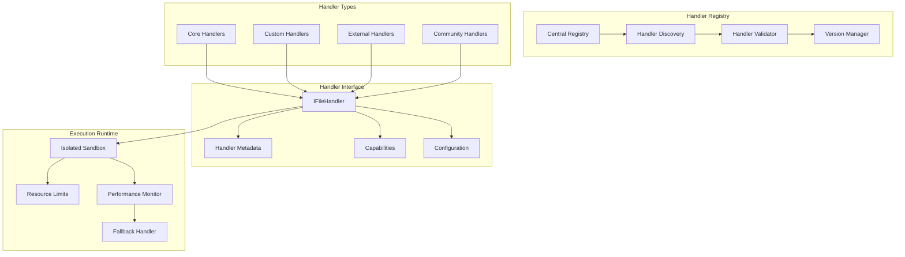
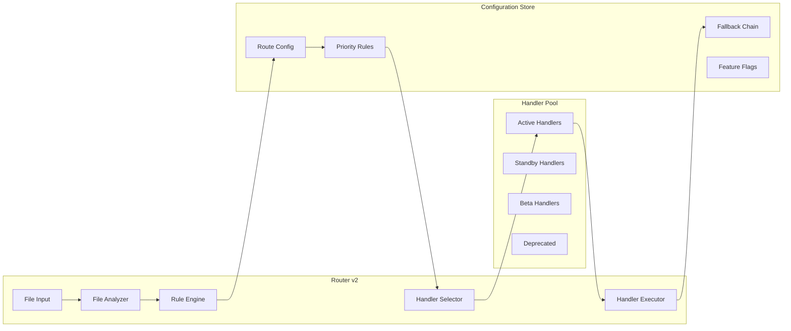
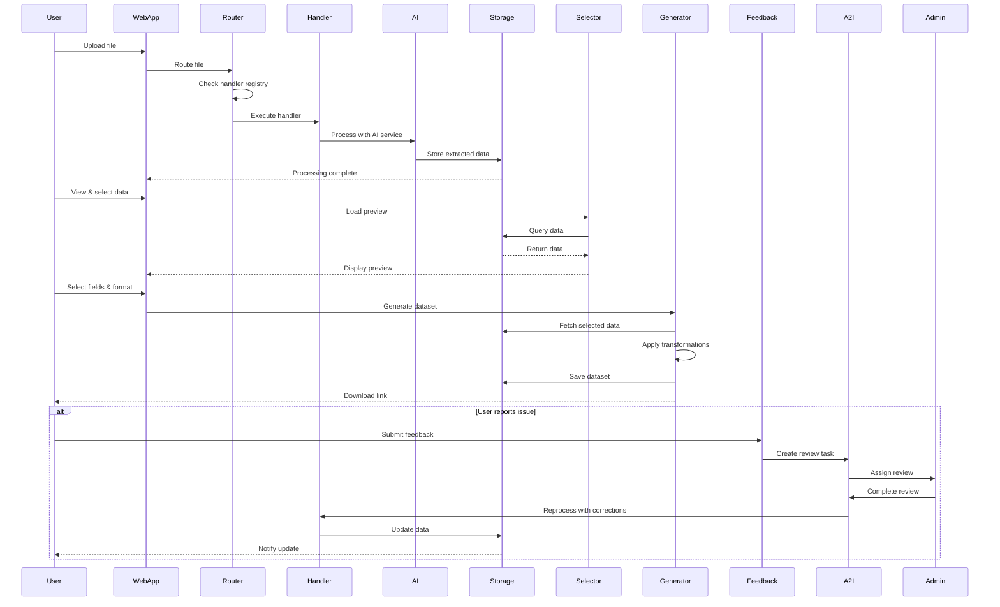

# AWS Data Processing Platform - Enhanced Architecture v3.0

## Executive Summary
Enhanced architecture with user-driven data selection, quality feedback loops, and extensible processing pipeline for dynamic file type support.

## New Core Components

### 1. Data Selection & Export Module
- Interactive data preview and field selection
- Multi-format export capabilities
- Custom dataset generation engine

### 2. Quality Feedback System
- User feedback collection and tracking
- Automated reprocessing workflows
- Human-in-the-loop review integration

### 3. Extensible Processing Framework
- Plugin-based file handler system
- Dynamic router configuration
- Hot-reload capability for new processors

## Enhanced System Architecture

```mermaid
graph TB
    subgraph "Frontend Layer"
        WebApp[Web Application]
        Preview[Data Preview Component]
        Selector[Field Selector UI]
        Feedback[Feedback Widget]
        Export[Export Manager]
    end
    
    subgraph "API Gateway Layer"
        APIG[API Gateway]
        GraphQL[AppSync GraphQL]
        WebSocket[WebSocket API]
    end
    
    subgraph "Processing Core"
        EventBridge[EventBridge]
        Router[Intelligent Router v2]
        Registry[Handler Registry]
        Plugins[Plugin Manager]
    end
    
    subgraph "Data Selection Service"
        SelectionAPI[Selection API Lambda]
        QueryEngine[Query Engine Fargate]
        DatasetGen[Dataset Generator]
        FormatConverter[Format Converter]
    end
    
    subgraph "Feedback System"
        FeedbackAPI[Feedback API]
        FeedbackStore[Feedback DynamoDB]
        ReprocessQueue[Reprocess SQS]
        A2I[Amazon A2I]
        MLPipeline[ML Training Pipeline]
    end
    
    subgraph "Extensible Handlers"
        CoreHandlers[Core Handlers]
        CustomHandlers[Custom Handlers]
        ExternalHandlers[External APIs]
        HandlerConfig[Handler Config Store]
    end
    
    subgraph "Processing Services"
        Lambda[Lambda Functions]
        Fargate[Fargate Tasks]
        SageMaker[SageMaker Endpoints]
        Batch[AWS Batch]
        StepFunctions[Step Functions]
    end
    
    subgraph "AI/ML Services"
        Textract[Textract]
        Comprehend[Comprehend]
        Transcribe[Transcribe]
        CustomModels[Custom Models]
    end
    
    subgraph "Data Storage"
        S3Raw[S3 Raw Data]
        S3Processed[S3 Processed]
        Metadata[Metadata Store]
        RedshiftServerless[Redshift Serverless]
        OpenSearch[OpenSearch]
    end
    
    WebApp --> Preview
    Preview --> Selector
    Selector --> Export
    WebApp --> Feedback
    
    WebApp --> APIG
    Preview --> GraphQL
    Selector --> GraphQL
    Export --> APIG
    Feedback --> APIG
    
    APIG --> SelectionAPI
    SelectionAPI --> QueryEngine
    QueryEngine --> DatasetGen
    DatasetGen --> FormatConverter
    
    APIG --> FeedbackAPI
    FeedbackAPI --> FeedbackStore
    FeedbackAPI --> ReprocessQueue
    ReprocessQueue --> A2I
    FeedbackStore --> MLPipeline
    
    EventBridge --> Router
    Router --> Registry
    Registry --> Plugins
    Plugins --> HandlerConfig
    
    Router --> CoreHandlers
    Router --> CustomHandlers
    Router --> ExternalHandlers
    
    CoreHandlers --> Lambda
    CustomHandlers --> Fargate
    ExternalHandlers --> SageMaker
    
    Lambda --> AI/ML Services
    Fargate --> AI/ML Services
    
    AI/ML Services --> S3Processed
    S3Processed --> Metadata
    Metadata --> RedshiftServerless
    Metadata --> OpenSearch
    
    QueryEngine --> RedshiftServerless
    QueryEngine --> OpenSearch
    QueryEngine --> S3Processed
```

## Component 1: User-Driven Data Selection & Export Module

### Frontend Components



### Backend Architecture

```yaml
DataSelectionService:
  Components:
    SelectionAPI:
      Type: Lambda
      Runtime: Python 3.11
      Memory: 1024MB
      Endpoints:
        - POST /preview/request
        - GET /preview/{sessionId}
        - POST /selection/save
        - POST /export/generate
        - GET /export/status/{jobId}
        - GET /export/download/{jobId}
    
    QueryEngine:
      Type: Fargate
      CPU: 2 vCPU
      Memory: 8GB
      Features:
        - Parallel query execution
        - Data sampling for preview
        - Schema inference
        - Join operations across sources
        - Aggregation support
    
    DatasetGenerator:
      Type: Step Functions
      States:
        ValidateSelection:
          Type: Lambda
          Action: Validate user selections
        
        FetchData:
          Type: Parallel
          Branches:
            - S3 data fetch
            - Redshift query
            - OpenSearch retrieval
        
        ApplyTransformations:
          Type: Lambda
          Actions:
            - Field mapping
            - Data type conversion
            - Custom formulas
            - Filtering
        
        GenerateOutput:
          Type: Choice
          Choices:
            SmallDataset: Lambda
            LargeDataset: Fargate
            HugeDataset: EMR
        
        DeliverDataset:
          Type: Lambda
          Methods:
            - S3 presigned URL
            - Email attachment
            - API webhook
            - SFTP transfer
```

### UI Mockup: Data Selection Interface

```
┌────────────────────────────────────────────────────────┐
│            Data Preview & Selection                    │
├────────────────────────────────────────────────────────┤
│                                                         │
│  Source: invoice_batch_2024.pdf (Processed)            │
│  Extracted: 5 tables, 127 entities, 3,450 text blocks  │
│                                                         │
│  ┌─────────────────┬────────────────────────────┐     │
│  │ Available Data  │  Preview                    │     │
│  ├─────────────────┼────────────────────────────┤     │
│  │ ☑ Tables (5)    │ Table: Invoice_Items        │     │
│  │   ☑ Invoice_Items│ ┌──────┬──────┬─────────┐ │     │
│  │   ☑ Customer_Info│ │ Item │ Qty  │ Price   │ │     │
│  │   ☐ Shipping    │ ├──────┼──────┼─────────┤ │     │
│  │   ☑ Totals      │ │ A001 │ 10   │ $123.45 │ │     │
│  │   ☐ Tax_Details │ │ B002 │ 5    │ $67.89  │ │     │
│  │                 │ │ C003 │ 15   │ $234.56 │ │     │
│  │ ☑ Entities (127)│ └──────┴──────┴─────────┘ │     │
│  │   ☑ PERSON (23) │                             │     │
│  │   ☑ ORG (15)    │ Select columns:            │     │
│  │   ☑ DATE (45)   │ ☑ Item ☑ Qty ☑ Price      │     │
│  │   ☐ LOCATION    │                             │     │
│  │   ☑ MONEY (44)  │ Transformations:           │     │
│  │                 │ [+] Add calculated field    │     │
│  │ ☐ Text Blocks   │ [+] Apply filter           │     │
│  │   ☐ Headers     │ [+] Group by               │     │
│  │   ☐ Paragraphs  │                             │     │
│  └─────────────────┴────────────────────────────┘     │
│                                                         │
│  Export Settings:                                       │
│  Format: [CSV ▼]  Encoding: [UTF-8 ▼]                 │
│  ☑ Include headers  ☑ Compress (ZIP)                  │
│                                                         │
│  [Preview Dataset]  [Save Template]  [Generate Export]  │
│                                                         │
└────────────────────────────────────────────────────────┘
```

## Component 2: User Feedback Loop for Extraction Quality

### Feedback System Architecture



### Feedback Collection Interface

```
┌────────────────────────────────────────────────────────┐
│            Data Quality Feedback                       │
├────────────────────────────────────────────────────────┤
│                                                         │
│  Dataset: DS_2024_001_invoice_processed                │
│  Issue Location: Table 3, Row 15, Column "Amount"      │
│                                                         │
│  Extracted Value: "$l,234.56"                          │
│  Correct Value: [$1,234.56_______________]             │
│                                                         │
│  Issue Type:                                           │
│  ○ Incorrect extraction                                │
│  ● OCR error                                          │
│  ○ Missing data                                       │
│  ○ Wrong format                                       │
│  ○ Other: [_____________________]                     │
│                                                         │
│  Severity: [Medium ▼]                                  │
│                                                         │
│  Additional Comments:                                  │
│  ┌──────────────────────────────────────────────┐     │
│  │ The OCR misread "1" as "l" in the amount.    │     │
│  │ This happens frequently with this font.      │     │
│  └──────────────────────────────────────────────┘     │
│                                                         │
│  ☑ Request reprocessing                                │
│  ☑ Apply fix to similar issues                         │
│                                                         │
│  [Submit Feedback]  [Request Human Review]  [Cancel]   │
│                                                         │
└────────────────────────────────────────────────────────┘
```

### Feedback Processing Pipeline

```yaml
FeedbackProcessingPipeline:
  Stages:
    1_Collection:
      Service: Lambda
      Actions:
        - Validate feedback
        - Extract context
        - Calculate confidence
        - Store in DynamoDB
    
    2_Triage:
      Service: Step Functions
      Decision:
        HighConfidenceAutoFix:
          Threshold: "> 90%"
          Action: Apply automatically
        
        MediumConfidenceReview:
          Threshold: "50-90%"
          Action: Send to A2I
        
        LowConfidenceManual:
          Threshold: "< 50%"
          Action: Queue for expert
    
    3_HumanReview:
      Service: Amazon A2I
      Workflow:
        TaskTemplate: DataCorrectionTemplate
        Reviewers: InternalTeam
        Consensus: 2 reviewers
        Timeout: 24 hours
    
    4_Reprocessing:
      Service: Lambda + Step Functions
      Actions:
        - Retrieve original file
        - Apply feedback corrections
        - Reprocess with tuned parameters
        - Update dataset
        - Notify user
    
    5_Learning:
      Service: SageMaker Pipeline
      Schedule: Weekly
      Actions:
        - Aggregate feedback data
        - Generate training dataset
        - Fine-tune models
        - A/B test improvements
        - Deploy if better
```

## Component 3: Extensible File Type Handler System

### Plugin Architecture



### Handler Plugin Specification

```yaml
HandlerSpecification:
  Metadata:
    name: "custom-cad-handler"
    version: "1.0.0"
    author: "Engineering Team"
    description: "Processes CAD files (DWG, DXF)"
    fileTypes:
      - extension: ".dwg"
        mimeType: "application/acad"
      - extension: ".dxf"
        mimeType: "application/dxf"
  
  Capabilities:
    maxFileSize: "500MB"
    supportsBatch: true
    supportsStreaming: false
    outputFormats:
      - "JSON"
      - "SVG"
      - "PNG"
    extractionTypes:
      - "geometry"
      - "metadata"
      - "layers"
      - "annotations"
  
  Runtime:
    type: "container"  # lambda | container | sagemaker
    image: "custom-cad-processor:latest"
    memory: 4096
    timeout: 300
    environment:
      - CAD_LICENSE_SERVER: "${secrets.cad_license}"
  
  Interface:
    process:
      input:
        file: "S3Object"
        options: "ProcessingOptions"
      output:
        result: "ProcessingResult"
        artifacts: "S3Object[]"
    
    validate:
      input:
        file: "S3Object"
      output:
        valid: "boolean"
        errors: "ValidationError[]"
    
    preview:
      input:
        file: "S3Object"
        pages: "number"
      output:
        thumbnails: "S3Object[]"
```

### Dynamic Router Configuration



### Handler Registration API

```typescript
// Handler Registration Interface
interface HandlerRegistration {
  // Register new handler
  POST /handlers/register
  {
    "metadata": {
      "name": "string",
      "version": "string",
      "fileTypes": ["string"]
    },
    "endpoint": "string",
    "authentication": {
      "type": "api_key|oauth|iam",
      "credentials": "encrypted_string"
    },
    "capabilities": {
      "maxFileSize": "string",
      "supportsBatch": "boolean",
      "outputFormats": ["string"]
    },
    "sla": {
      "timeout": "number",
      "retries": "number",
      "priority": "number"
    }
  }
  
  // Update handler
  PUT /handlers/{handlerId}
  
  // Enable/Disable handler
  PATCH /handlers/{handlerId}/status
  
  // Test handler
  POST /handlers/{handlerId}/test
  
  // Get handler metrics
  GET /handlers/{handlerId}/metrics
}
```

## Enhanced Data Flow with New Components



## Implementation Timeline for New Components

### Phase 1: Data Selection Module (Weeks 1-3)
- Week 1: Build preview UI components
- Week 2: Implement query engine and selection API
- Week 3: Add dataset generation and export formats

### Phase 2: Feedback System (Weeks 4-5)
- Week 4: Create feedback UI and API
- Week 5: Integrate A2I and reprocessing pipeline

### Phase 3: Extensible Handlers (Weeks 6-8)
- Week 6: Build handler registry and plugin interface
- Week 7: Implement dynamic router v2
- Week 8: Add handler management APIs and monitoring

## Cost Impact Analysis

### New Component Costs
```yaml
DataSelectionModule:
  QueryEngine (Fargate): $50-200/month
  DatasetGenerator (Lambda): $20-100/month
  Storage (temp datasets): $10-50/month
  Total: $80-350/month

FeedbackSystem:
  A2I Human Review: $0.50 per review
  Reprocessing: $20-100/month
  ML Training: $50-200/month
  Total: $70-300/month + reviews

ExtensibleHandlers:
  Registry (DynamoDB): $5-20/month
  Custom handlers (varies): $50-500/month
  Monitoring: $10-30/month
  Total: $65-550/month

Overall Additional Cost: $215-1200/month
ROI: 40% reduction in manual data cleanup
```

## Security Considerations

### Data Selection Security
- Row-level security for multi-tenant data
- Encrypted export links with expiration
- Audit logging for all data access

### Feedback Security
- PII detection before storing feedback
- Encrypted feedback storage
- Role-based access for reviews

### Handler Security
- Sandboxed execution environment
- Resource limits and timeouts
- Code signing for handlers
- Vulnerability scanning

## Monitoring Enhancements

```yaml
NewMetrics:
  DataSelection:
    - Preview request latency
    - Export generation time
    - Format conversion success rate
    - User selection patterns
  
  Feedback:
    - Feedback submission rate
    - Issue resolution time
    - Reprocessing success rate
    - Model improvement metrics
  
  Handlers:
    - Handler registration count
    - Handler execution time
    - Handler failure rate
    - Plugin usage statistics

Dashboards:
  - User Experience Dashboard
  - Quality Metrics Dashboard
  - Handler Performance Dashboard
  - Cost Attribution Dashboard
```

---

**Document Version**: 3.0  
**Key Enhancements**: User-driven data selection, Quality feedback loop, Extensible handlers  
**Architecture Pattern**: Plugin-based, Event-driven, User-centric  
**Last Updated**: 2025-09-16