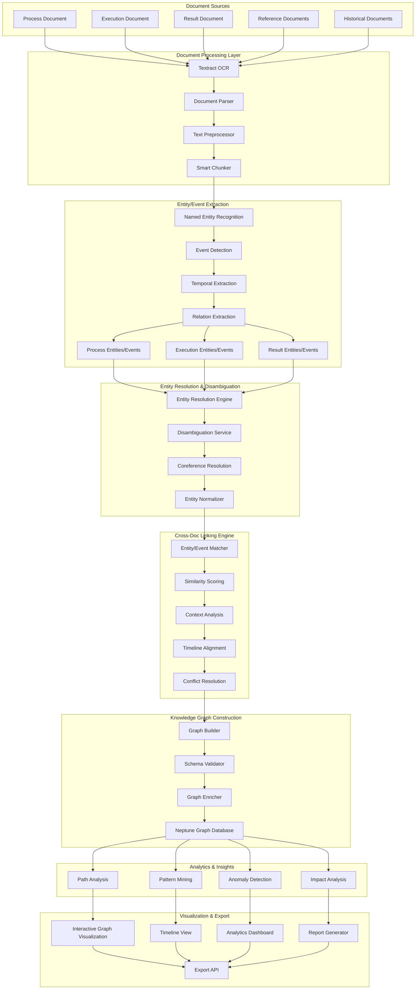
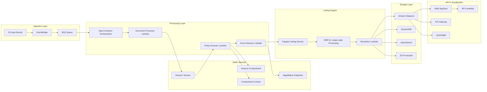
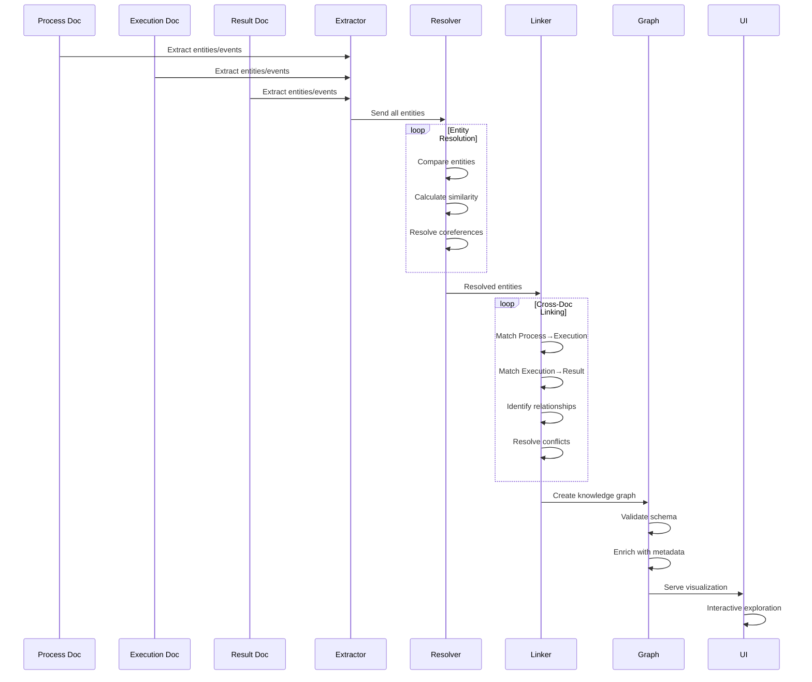

# Cross-Document Entity & Event Linking Architecture

## Executive Summary
An advanced AWS architecture for extracting, linking, and visualizing entities and events across multiple related documents (Process, Execution, and Result documents), creating a comprehensive knowledge graph.

## Enhanced Cross-Document Linking Architecture



## Detailed Component Architecture

### 1. Entity & Event Extraction Pipeline

```yaml
EntityEventExtraction:
  EntityTypes:
    Process_Document:
      - Process_Name
      - Process_ID
      - Process_Owner
      - Department
      - System
      - Input_Requirements
      - Output_Specifications
      - Compliance_Requirements
      - Risk_Factors
      - KPIs
    
    Execution_Document:
      - Execution_ID
      - Executor_Name
      - Execution_Date
      - Resources_Used
      - Duration
      - Status
      - Deviations
      - Issues_Encountered
      - Approvals
    
    Result_Document:
      - Result_ID
      - Outcome
      - Metrics_Achieved
      - Quality_Score
      - Deliverables
      - Stakeholder_Feedback
      - Next_Actions
      - Lessons_Learned
  
  EventTypes:
    Temporal_Events:
      - Start_Event
      - End_Event
      - Milestone_Event
      - Decision_Point
      - Review_Event
    
    State_Change_Events:
      - Status_Change
      - Approval_Event
      - Rejection_Event
      - Escalation_Event
    
    Business_Events:
      - Transaction
      - Communication
      - Meeting
      - Delivery
      - Payment
```

### 2. Entity Resolution & Linking Algorithm

```python
# Pseudo-code for entity resolution
class EntityLinker:
    def __init__(self):
        self.similarity_threshold = 0.85
        self.context_weight = 0.3
        self.name_weight = 0.4
        self.temporal_weight = 0.3
    
    def link_entities(self, entity1, entity2):
        """
        Link entities across documents
        """
        # Name similarity
        name_sim = calculate_string_similarity(
            entity1.name, 
            entity2.name
        )
        
        # Context similarity
        context_sim = calculate_embedding_similarity(
            entity1.context_embedding,
            entity2.context_embedding
        )
        
        # Temporal alignment
        temporal_sim = calculate_temporal_overlap(
            entity1.time_range,
            entity2.time_range
        )
        
        # Weighted score
        final_score = (
            name_sim * self.name_weight +
            context_sim * self.context_weight +
            temporal_sim * self.temporal_weight
        )
        
        return final_score > self.similarity_threshold
    
    def resolve_coreferences(self, entities):
        """
        Resolve coreferences within and across documents
        """
        clusters = []
        for entity in entities:
            matched = False
            for cluster in clusters:
                if self.matches_cluster(entity, cluster):
                    cluster.add(entity)
                    matched = True
                    break
            if not matched:
                clusters.append({entity})
        
        return clusters
```

### 3. AWS Implementation Architecture



### 4. Knowledge Graph Schema

```yaml
GraphSchema:
  Nodes:
    Process:
      Properties:
        - process_id: String
        - name: String
        - type: String
        - owner: String
        - department: String
        - created_date: Date
        - status: String
    
    Execution:
      Properties:
        - execution_id: String
        - process_ref: String
        - executor: String
        - start_time: DateTime
        - end_time: DateTime
        - status: String
        - deviation_flag: Boolean
    
    Result:
      Properties:
        - result_id: String
        - execution_ref: String
        - outcome: String
        - score: Float
        - delivered_date: Date
    
    Person:
      Properties:
        - person_id: String
        - name: String
        - role: String
        - department: String
    
    Event:
      Properties:
        - event_id: String
        - type: String
        - timestamp: DateTime
        - description: String
    
    Entity:
      Properties:
        - entity_id: String
        - type: String
        - name: String
        - attributes: Map
  
  Edges:
    EXECUTES:
      From: Execution
      To: Process
      Properties:
        - execution_date: Date
        - duration: Integer
    
    PRODUCES:
      From: Execution
      To: Result
      Properties:
        - delivery_date: Date
        - quality_score: Float
    
    INVOLVES:
      From: [Process, Execution, Result]
      To: Person
      Properties:
        - role: String
        - responsibility: String
    
    TRIGGERS:
      From: Event
      To: Event
      Properties:
        - causality_score: Float
        - time_delta: Integer
    
    REFERENCES:
      From: [Process, Execution, Result]
      To: Entity
      Properties:
        - reference_type: String
        - confidence: Float
```

### 5. Cross-Document Linking Logic



### 6. Similarity Scoring & Matching

```yaml
SimilarityScoring:
  StringMatching:
    Algorithms:
      - Levenshtein Distance
      - Jaro-Winkler
      - Fuzzy Matching
      - Phonetic Matching (Soundex)
    
    Thresholds:
      Exact: 1.0
      High: 0.9-0.99
      Medium: 0.7-0.89
      Low: 0.5-0.69
  
  SemanticMatching:
    Method: BERT Embeddings
    Model: sentence-transformers
    Similarity: Cosine similarity
    Threshold: 0.85
  
  ContextualMatching:
    Features:
      - Surrounding entities
      - Document section
      - Temporal context
      - Attribute overlap
    
    Scoring:
      Formula: weighted_avg(features)
      Weights: ML-learned
  
  TemporalMatching:
    Rules:
      - Same date: 1.0
      - Within 7 days: 0.8
      - Within 30 days: 0.6
      - Within 90 days: 0.4
      - Beyond 90 days: 0.2
```

### 7. Visualization Interface

```
┌────────────────────────────────────────────────────────┐
│         Cross-Document Entity Relationship Graph        │
├────────────────────────────────────────────────────────┤
│                                                         │
│  View: [Graph ▼] [Timeline] [Table] [Sankey]           │
│                                                         │
│  ┌──────────────────────────────────────────────┐     │
│  │                                              │     │
│  │    [Process A]                               │     │
│  │         ↓                                    │     │
│  │    ┌─────────┐     ┌─────────┐             │     │
│  │    │ Exec 1  │────→│Result 1 │             │     │
│  │    └─────────┘     └─────────┘             │     │
│  │         ↓               ↓                    │     │
│  │    ┌─────────┐     ┌─────────┐             │     │
│  │    │ Exec 2  │────→│Result 2 │             │     │
│  │    └─────────┘     └─────────┘             │     │
│  │         ↓                                    │     │
│  │    [John Doe]──involves──[Mary Smith]       │     │
│  │                                              │     │
│  └──────────────────────────────────────────────┘     │
│                                                         │
│  Entity Details:                                       │
│  ┌──────────────────────────────────────────────┐     │
│  │ Name: Process A                              │     │
│  │ Type: Business Process                       │     │
│  │ Documents: 3 (Process, 2 Executions)         │     │
│  │ Related Entities: 12                         │     │
│  │ Confidence: 95%                              │     │
│  └──────────────────────────────────────────────┘     │
│                                                         │
│  Filters:                                              │
│  Entity Type: [All ▼]  Confidence: [>80% ▼]           │
│  Date Range: [Last 30 days ▼]                         │
│                                                         │
│  [Export Graph] [Download Report] [API Access]         │
│                                                         │
└────────────────────────────────────────────────────────┘
```

### 8. Timeline View

```
┌────────────────────────────────────────────────────────┐
│              Entity/Event Timeline                     │
├────────────────────────────────────────────────────────┤
│                                                         │
│  2024-01-01 ─────────────────────→ 2024-12-31         │
│                                                         │
│  Process Definition                                    │
│  ●─────────────────────────────────────────────       │
│   ↓                                                    │
│  Execution 1                                           │
│      ●──────●                                         │
│         ↓                                              │
│      Result 1                                          │
│           ●                                            │
│                                                         │
│  Execution 2                                           │
│                ●─────────●                            │
│                      ↓                                 │
│                   Result 2                             │
│                        ●                               │
│                                                         │
│  Key Events:                                           │
│  ⚡ Jan 15: Process initiated                          │
│  ⚡ Feb 20: First execution started                    │
│  ⚡ Mar 10: Result 1 delivered                         │
│  ⚡ Jun 15: Second execution started                   │
│  ⚠ Jul 20: Deviation detected                         │
│  ✓ Aug 30: Result 2 delivered                         │
│                                                         │
└────────────────────────────────────────────────────────┘
```

## Implementation Details

### Step Functions Workflow

```yaml
StateMachine:
  StartAt: DocumentIngestion
  States:
    DocumentIngestion:
      Type: Parallel
      Branches:
        - ProcessDocument:
            Type: Task
            Resource: arn:aws:lambda:ExtractProcess
        - ExecutionDocument:
            Type: Task
            Resource: arn:aws:lambda:ExtractExecution
        - ResultDocument:
            Type: Task
            Resource: arn:aws:lambda:ExtractResult
      Next: EntityResolution
    
    EntityResolution:
      Type: Task
      Resource: arn:aws:states:fargate:ResolveEntities
      Next: CrossDocumentLinking
    
    CrossDocumentLinking:
      Type: Map
      ItemsPath: $.entities
      MaxConcurrency: 10
      Iterator:
        StartAt: LinkEntity
        States:
          LinkEntity:
            Type: Task
            Resource: arn:aws:lambda:LinkEntities
            End: true
      Next: GraphConstruction
    
    GraphConstruction:
      Type: Task
      Resource: arn:aws:lambda:BuildGraph
      Next: StoreInNeptune
    
    StoreInNeptune:
      Type: Task
      Resource: arn:aws:states:neptune:LoadGraph
      Next: IndexInOpenSearch
    
    IndexInOpenSearch:
      Type: Task
      Resource: arn:aws:lambda:IndexEntities
      End: true
```

### Lambda Functions

```python
# Entity Extraction Lambda
def extract_entities_handler(event, context):
    """
    Extract entities from document
    """
    document_type = event['document_type']
    s3_path = event['s3_path']
    
    # Extract text
    text = extract_text_from_s3(s3_path)
    
    # NER based on document type
    if document_type == 'process':
        entities = extract_process_entities(text)
    elif document_type == 'execution':
        entities = extract_execution_entities(text)
    else:
        entities = extract_result_entities(text)
    
    # Extract temporal information
    temporal_data = extract_temporal_info(text)
    
    # Extract relationships
    relationships = extract_relationships(text, entities)
    
    return {
        'document_id': event['document_id'],
        'entities': entities,
        'temporal': temporal_data,
        'relationships': relationships
    }

# Entity Linking Lambda
def link_entities_handler(event, context):
    """
    Link entities across documents
    """
    entity = event['entity']
    all_entities = get_all_entities_from_dynamodb()
    
    matches = []
    for candidate in all_entities:
        score = calculate_similarity(entity, candidate)
        if score > THRESHOLD:
            matches.append({
                'entity_id': candidate['id'],
                'score': score,
                'type': 'cross_reference'
            })
    
    # Store links
    store_entity_links(entity['id'], matches)
    
    return {
        'entity_id': entity['id'],
        'matches': len(matches),
        'links': matches
    }
```

### Neptune Graph Queries

```python
# Gremlin queries for Neptune
class GraphQueries:
    @staticmethod
    def find_execution_path(process_id, result_id):
        """
        Find all execution paths from process to result
        """
        query = """
        g.V().has('process_id', process_id)
          .outE('EXECUTES')
          .inV()
          .outE('PRODUCES')
          .inV().has('result_id', result_id)
          .path()
        """
        return query
    
    @staticmethod
    def find_related_entities(entity_id, depth=2):
        """
        Find all related entities up to specified depth
        """
        query = f"""
        g.V().has('entity_id', '{entity_id}')
          .repeat(both().simplePath())
          .times({depth})
          .dedup()
        """
        return query
    
    @staticmethod
    def detect_anomalies():
        """
        Detect anomalous patterns in the graph
        """
        query = """
        g.V().hasLabel('execution')
          .where(
            out('PRODUCES').count().is(eq(0))
          )
          .union(
            identity(),
            in('EXECUTES').values('name')
          )
        """
        return query
```

## Cost Optimization

```yaml
CostOptimization:
  ProcessingTier:
    Small (<100 docs/day):
      - Lambda: On-demand
      - Neptune: db.t3.medium
      - Cost: ~$200/month
    
    Medium (100-1000 docs/day):
      - Lambda: Provisioned concurrency
      - Fargate: Spot instances
      - Neptune: db.r5.large
      - Cost: ~$800/month
    
    Large (>1000 docs/day):
      - EMR: Reserved instances
      - Neptune: db.r5.xlarge cluster
      - SageMaker: Endpoints
      - Cost: ~$3000/month
  
  Caching:
    - ElastiCache for entity cache
    - S3 for processed documents
    - DynamoDB for link cache
```

## Performance Metrics

```yaml
PerformanceTargets:
  EntityExtraction:
    - Precision: >0.92
    - Recall: >0.88
    - F1-Score: >0.90
  
  EntityLinking:
    - Accuracy: >0.95
    - Processing: <5s per document
    - Batch: 100 docs in <3 minutes
  
  GraphConstruction:
    - Node creation: 1000/second
    - Edge creation: 500/second
    - Query response: <100ms
  
  EndToEnd:
    - 3 documents: <30 seconds
    - 10 documents: <2 minutes
    - 100 documents: <15 minutes
```

---

**Document Version**: 1.0  
**Focus**: Cross-document entity and event linking with knowledge graph construction  
**AWS Services**: Lambda, Step Functions, Neptune, Comprehend, OpenSearch  
**Implementation Time**: 6-8 weeks  
**Last Updated**: 2025-09-16