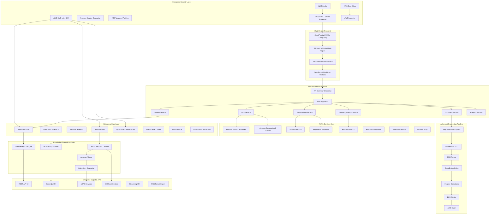

# Enterprise Text-to-Dataset Architecture
## Advanced LLM Training Data Pipeline with Cross-Document Intelligence

### Executive Summary
A comprehensive, enterprise-grade AWS architecture combining advanced text processing, cross-document entity linking, and knowledge graph construction for sophisticated LLM training dataset generation. Built with CIA compliance, high availability, and enterprise security standards.

## Enterprise Architecture Overview



## Advanced Feature Set

### 1. Intelligent Document Processing

```yaml
AdvancedDocumentProcessing:
  SupportedFormats:
    Text:
      - PDF (text, scanned, forms, tables)
      - Word (.docx, .doc, .rtf)
      - PowerPoint (.pptx, .ppt)
      - Excel (.xlsx, .xls, .csv)
      - Plain text (.txt, .md, .rst)
      - HTML/XML with structure preservation
      - Email formats (.eml, .msg, .pst)
      - Code files (50+ languages)
    
    Multimedia:
      - Images with OCR (PNG, JPG, TIFF)
      - Scanned documents
      - Handwritten text
      - Audio transcription integration
    
    Specialized:
      - Legal documents
      - Medical records (HIPAA compliant)
      - Financial statements
      - Scientific papers
      - Patent documents
  
  IntelligentParsing:
    StructureDetection:
      - Table extraction and preservation
      - Form field recognition
      - Layout analysis
      - Section identification
      - Header/footer handling
    
    ContentUnderstanding:
      - Document classification
      - Content type detection
      - Language identification (100+ languages)
      - Reading order optimization
      - Metadata extraction
    
    QualityAssurance:
      - Confidence scoring
      - Error detection
      - Manual review queuing
      - Quality metrics tracking
```

### 2. Advanced NLP & Understanding

```yaml
EnterpriseNLP:
  CoreNLP:
    EntityRecognition:
      StandardEntities:
        - PERSON, ORGANIZATION, LOCATION
        - DATE, TIME, MONEY, PERCENTAGE
        - EMAIL, PHONE, URL, IP_ADDRESS
        - CREDIT_CARD, SSN, BANK_ACCOUNT
      
      CustomEntities:
        - Domain-specific training
        - Industry terminology
        - Company-specific entities
        - Technical vocabulary
      
      AdvancedFeatures:
        - Nested entity recognition
        - Entity disambiguation
        - Coreference resolution
        - Entity linking to knowledge bases
    
    RelationshipExtraction:
      Types:
        - Semantic relationships
        - Temporal relationships
        - Causal relationships
        - Hierarchical relationships
      
      Confidence:
        - Machine learning confidence scores
        - Human validation workflow
        - Active learning feedback
    
    AdvancedAnalytics:
      SemanticAnalysis:
        - Topic modeling (LDA, BERT-based)
        - Semantic similarity
        - Concept extraction
        - Intent detection
      
      SentimentAnalysis:
        - Multi-level sentiment (document, paragraph, sentence)
        - Emotion detection
        - Subjectivity analysis
        - Aspect-based sentiment
      
      TextSummarization:
        - Extractive summarization
        - Abstractive summarization (BART, T5)
        - Multi-document summarization
        - Query-focused summarization
```

### 3. Cross-Document Intelligence Engine

```yaml
CrossDocumentIntelligence:
  EntityLinkingEngine:
    Algorithm:
      - BERT-based similarity matching
      - Graph neural networks
      - Ensemble methods
      - Active learning optimization
    
    Features:
      - Cross-document entity resolution
      - Temporal entity tracking
      - Entity evolution analysis
      - Conflict resolution
      - Uncertainty quantification
    
    Performance:
      - Real-time linking for <1000 entities
      - Batch processing for large corpora
      - Incremental updates
      - Version control for entities
  
  EventDetectionLinking:
    EventTypes:
      - Business processes
      - State changes
      - Temporal events
      - Causal events
      - Communication events
    
    Linking:
      - Event sequence reconstruction
      - Timeline alignment
      - Causal chain detection
      - Anomaly identification
      - Pattern mining
  
  KnowledgeGraphConstruction:
    GraphSchema:
      Nodes:
        - Entities (resolved and linked)
        - Events (temporally ordered)
        - Documents (source metadata)
        - Concepts (abstract ideas)
        - Relationships (typed connections)
      
      Edges:
        - Semantic relationships
        - Temporal relationships
        - Causal relationships
        - Reference relationships
        - Similarity relationships
    
    GraphOperations:
      - Real-time updates
      - Graph querying (Gremlin, SPARQL)
      - Subgraph extraction
      - Graph algorithms (centrality, clustering)
      - Graph visualization
```

### 4. Advanced Dataset Generation

```yaml
EnterpriseDatasetGeneration:
  DatasetTypes:
    LanguageModeling:
      Formats:
        - GPT-style training data
        - BERT pre-training format
        - T5 text-to-text format
        - Custom transformer formats
      
      Features:
        - Context window optimization
        - Token-level annotations
        - Attention mask generation
        - Special token handling
    
    InstructionTuning:
      Formats:
        - Question-answer pairs
        - Instruction-response pairs
        - Few-shot examples
        - Chain-of-thought reasoning
      
      Quality:
        - Automated quality scoring
        - Diversity metrics
        - Difficulty assessment
        - Bias detection
    
    SpecializedTasks:
      EntityRecognition:
        - BIO/BILOU tagging
        - Nested entity annotation
        - Entity linking datasets
        - Cross-lingual entity data
      
      RelationExtraction:
        - Sentence-level relations
        - Document-level relations
        - Temporal relations
        - Knowledge graph triples
      
      TextClassification:
        - Multi-class classification
        - Multi-label classification
        - Hierarchical classification
        - Zero-shot classification
      
      TextGeneration:
        - Summarization datasets
        - Paraphrasing datasets
        - Style transfer datasets
        - Creative writing datasets
  
  QualityAssurance:
    AutomatedQuality:
      - Coherence scoring
      - Factual consistency checking
      - Bias detection and mitigation
      - Toxicity filtering
      - Duplicate detection
    
    HumanInTheLoop:
      - Annotation interfaces
      - Quality review workflows
      - Expert validation
      - Feedback integration
      - Continuous improvement
  
  ExportFormats:
    MLFrameworks:
      - HuggingFace datasets
      - TensorFlow datasets
      - PyTorch datasets
      - JAX datasets
    
    StandardFormats:
      - JSON/JSONL
      - Parquet (optimized)
      - CSV/TSV
      - XML/RDF
      - Arrow/Feather
    
    CloudOptimized:
      - Delta Lake format
      - Iceberg tables
      - Hudi datasets
      - Compressed archives
```

### 5. Enterprise Security & Compliance

```yaml
EnterpriseSecurity:
  ZeroTrustArchitecture:
    NetworkSecurity:
      - VPC with private subnets
      - NAT Gateway for outbound
      - VPC endpoints for AWS services
      - Network ACLs and security groups
      - AWS PrivateLink connections
    
    AccessControl:
      - IAM roles with least privilege
      - RBAC with fine-grained permissions
      - ABAC for dynamic access control
      - MFA enforcement
      - Session management
    
    DataProtection:
      EncryptionAtRest:
        - S3: SSE-KMS with customer keys
        - EBS: Encrypted volumes
        - RDS: TDE enabled
        - DynamoDB: Encryption enabled
        - Neptune: Encryption enabled
      
      EncryptionInTransit:
        - TLS 1.3 for all communications
        - Certificate management (ACM)
        - API Gateway with SSL
        - Internal service mesh encryption
  
  ComplianceFrameworks:
    Regulations:
      - SOC 2 Type II
      - ISO 27001
      - GDPR compliance
      - HIPAA (healthcare data)
      - PCI DSS (payment data)
      - SOX (financial data)
    
    Features:
      - Data residency controls
      - Audit trail completeness
      - Data retention policies
      - Right to be forgotten
      - Consent management
      - Privacy impact assessments
  
  AdvancedThreatProtection:
    Services:
      - AWS GuardDuty (threat detection)
      - AWS Security Hub (compliance)
      - AWS Config (configuration monitoring)
      - AWS CloudTrail (audit logging)
      - AWS Inspector (vulnerability assessment)
    
    CustomSecurity:
      - Runtime application security
      - Anomaly detection in data access
      - Behavioral analysis
      - Threat intelligence integration
      - Incident response automation
```

### 6. High-Performance Architecture

```yaml
PerformanceOptimization:
  ComputeOptimization:
    Microservices:
      - Containerized services (EKS)
      - Serverless functions (Lambda)
      - Long-running services (Fargate)
      - Batch processing (AWS Batch)
      - GPU instances for ML (P4, G4)
    
    AutoScaling:
      - Horizontal pod autoscaling
      - Vertical pod autoscaling
      - Lambda concurrency scaling
      - DynamoDB auto-scaling
      - Neptune read replicas
    
    LoadBalancing:
      - Application Load Balancer
      - Network Load Balancer
      - API Gateway throttling
      - Service mesh load balancing
      - Global load balancing
  
  DataOptimization:
    Caching:
      - ElastiCache (Redis Cluster)
      - CloudFront edge caching
      - API Gateway caching
      - Application-level caching
      - Query result caching
    
    DatabaseOptimization:
      - Read replicas
      - Connection pooling
      - Query optimization
      - Index optimization
      - Partitioning strategies
    
    StorageOptimization:
      - S3 Transfer Acceleration
      - S3 Intelligent Tiering
      - CloudFront compression
      - Data compression
      - Delta encoding
  
  NetworkOptimization:
    - CloudFront global distribution
    - VPC peering optimization
    - Direct Connect for large data
    - Content delivery optimization
    - API response compression
```

### 7. Advanced Analytics & Insights

```yaml
EnterpriseAnalytics:
  RealTimeAnalytics:
    StreamProcessing:
      - Kinesis Data Streams
      - Kinesis Analytics
      - Real-time dashboards
      - Anomaly detection
      - Alert systems
    
    Metrics:
      - Processing throughput
      - Quality metrics
      - Cost optimization
      - User behavior
      - System performance
  
  AdvancedVisualizations:
    KnowledgeGraphViz:
      - Interactive graph exploration
      - Multi-dimensional filtering
      - Timeline visualization
      - Relationship analysis
      - Pattern discovery
    
    DatasetAnalytics:
      - Quality distribution analysis
      - Bias detection visualization
      - Diversity metrics
      - Coverage analysis
      - Performance prediction
  
  BusinessIntelligence:
    - Executive dashboards
    - ROI analysis
    - Usage analytics
    - Predictive analytics
    - Recommendation systems
```

### 8. Enterprise API Suite

```yaml
EnterpriseAPIs:
  RESTAPIv2:
    Features:
      - OpenAPI 3.0 specification
      - Rate limiting and throttling
      - API versioning
      - Pagination and filtering
      - Bulk operations
      - Async processing endpoints
    
    Endpoints:
      - Document management
      - Processing workflows
      - Dataset operations
      - Analytics queries
      - User management
      - Billing and usage
  
  GraphQLAPI:
    Features:
      - Single endpoint for all queries
      - Real-time subscriptions
      - Field-level permissions
      - Query complexity analysis
      - Caching optimization
    
    Schema:
      - Document types
      - Entity types
      - Relationship types
      - Dataset types
      - Analytics types
  
  gRPCServices:
    Services:
      - High-performance document processing
      - Streaming data ingestion
      - Real-time entity linking
      - Binary data handling
      - Service-to-service communication
  
  WebhookSystem:
    Events:
      - Document processing completed
      - Entity linking finished
      - Dataset generation ready
      - Quality checks failed
      - System alerts
    
    Features:
      - Retry mechanisms
      - Signature verification
      - Event filtering
      - Delivery guarantees
      - Rate limiting
  
  StreamingAPI:
    Protocols:
      - WebSocket for real-time updates
      - Server-Sent Events (SSE)
      - gRPC streaming
      - Kafka integration
    
    Use Cases:
      - Real-time processing status
      - Live analytics updates
      - Collaborative annotation
      - System monitoring
```

### 9. Cost Optimization & Scaling

```yaml
EnterpriseCostOptimization:
  Tier1_Department (0-10K docs/month):
    Services:
      - Lambda: 1GB, provisioned
      - DynamoDB: On-demand
      - S3: Intelligent tiering
      - Neptune: db.t3.medium
      - EKS: 2 nodes (t3.medium)
    Cost: $500-1,500/month
  
  Tier2_Enterprise (10K-100K docs/month):
    Services:
      - EKS: 5 nodes (c5.large)
      - DynamoDB: Provisioned
      - Neptune: db.r5.large cluster
      - OpenSearch: 3 nodes
      - SageMaker: 2 endpoints
    Cost: $2,000-8,000/month
  
  Tier3_Global (100K+ docs/month):
    Services:
      - EKS: Auto-scaling cluster
      - Multi-region deployment
      - Reserved instances
      - Dedicated support
      - Custom ML models
    Cost: $10,000-50,000/month
  
  CostOptimization:
    Strategies:
      - Spot instances for batch processing
      - Scheduled scaling
      - Storage tiering
      - Reserved capacity
      - Resource tagging and cost allocation
    
    Monitoring:
      - Real-time cost tracking
      - Budget alerts
      - Cost optimization recommendations
      - Resource utilization analysis
```

### 10. Disaster Recovery & Business Continuity

```yaml
DisasterRecovery:
  BackupStrategy:
    Data:
      - S3 cross-region replication
      - DynamoDB global tables
      - Neptune cross-region backups
      - EBS snapshots
      - RDS automated backups
    
    Applications:
      - Multi-region deployment
      - Infrastructure as Code
      - Container image replication
      - Configuration backups
  
  RecoveryObjectives:
    RTO: <15 minutes
    RPO: <5 minutes
    Availability: 99.99%
    
  Testing:
    - Monthly DR drills
    - Automated failover testing
    - Data integrity verification
    - Performance validation
```

## Implementation Roadmap

### Phase 1: Foundation (Weeks 1-4)
- Core infrastructure setup
- Basic document processing
- Security implementation
- CI/CD pipeline

### Phase 2: Advanced Processing (Weeks 5-8)
- Advanced NLP implementation
- Cross-document linking
- Knowledge graph construction
- Quality assurance

### Phase 3: Enterprise Features (Weeks 9-12)
- Advanced analytics
- Enterprise APIs
- Multi-region deployment
- Performance optimization

### Phase 4: Intelligence & Automation (Weeks 13-16)
- AI-powered insights
- Automated quality control
- Advanced visualizations
- Business intelligence

---

**Version**: 1.0  
**Focus**: Enterprise-grade text-to-dataset pipeline with cross-document intelligence  
**Cost Range**: $500-50,000/month based on scale  
**Processing Speed**: 2-10 seconds per document  
**Security**: Enterprise-grade CIA compliance  
**Scalability**: Handles millions of documents  
**Last Updated**: 2025-09-16