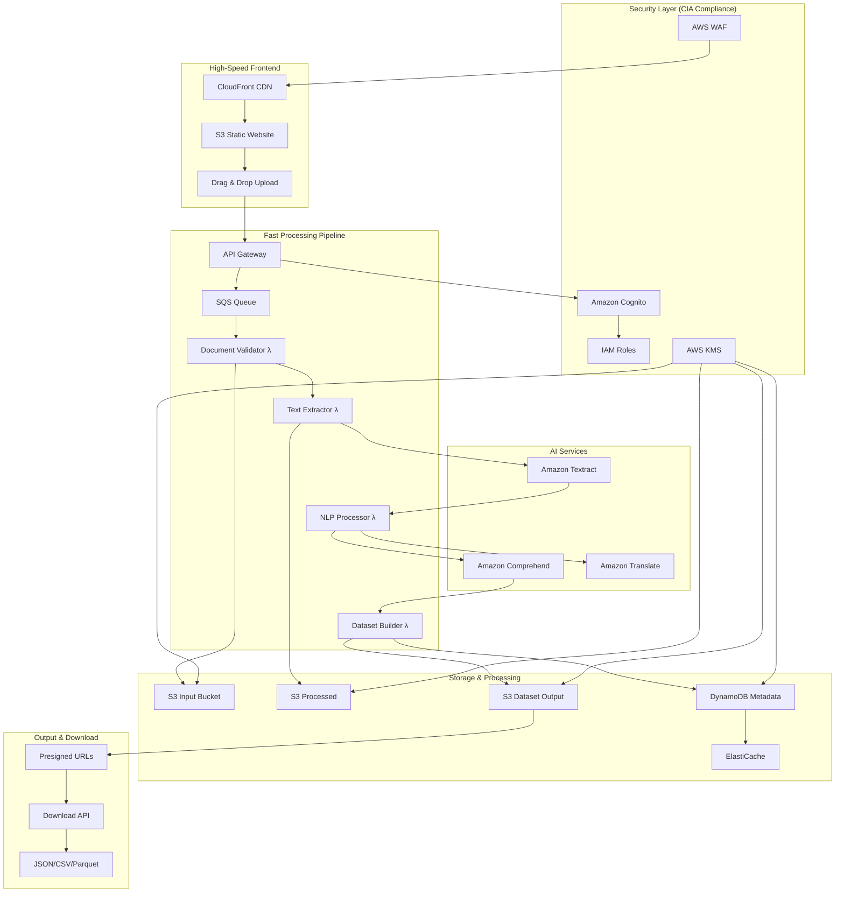
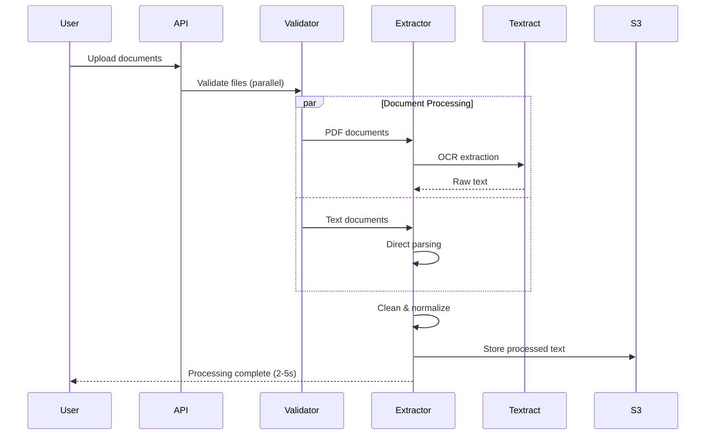
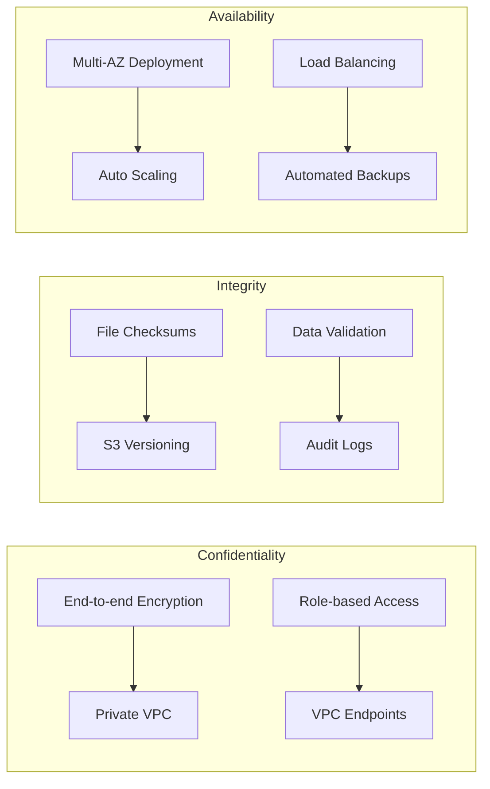

# Essential Text-to-Dataset Architecture
## High-Performance LLM Training Data Pipeline

### Executive Summary
A streamlined, CIA-compliant AWS architecture for converting text documents into structured datasets for LLM training. Optimized for speed, security, and cost-effectiveness with essential features only.

## Core Architecture Overview



## Essential Features Pipeline

### 1. Document Ingestion & Validation

```yaml
DocumentProcessor:
  SupportedFormats:
    - PDF (text & scanned)
    - Word (.docx, .doc)
    - Plain Text (.txt)
    - Rich Text (.rtf)
    - HTML/XML
    - Markdown (.md)
    - Email files (.eml, .msg)
  
  Validation:
    MaxFileSize: 50MB
    MaxBatchSize: 100 files
    VirusScan: AWS GuardDuty
    ContentValidation: Basic text extraction test
    
  Security:
    Encryption: AES-256 (KMS)
    AccessControl: Pre-signed URLs
    Audit: CloudTrail logging
```

### 2. High-Speed Text Extraction



### 3. Essential NLP Processing

```yaml
NLPPipeline:
  CoreFeatures:
    TextCleaning:
      - Remove special characters
      - Fix encoding issues
      - Normalize whitespace
      - Sentence segmentation
      
    EntityExtraction:
      Service: Amazon Comprehend
      Entities:
        - PERSON
        - ORGANIZATION
        - LOCATION
        - DATE
        - MONEY
        - QUANTITY
        - CUSTOM (domain-specific)
    
    BasicAnalytics:
      - Language detection
      - Sentiment analysis
      - Key phrase extraction
      - Document classification
      - PII detection & redaction
    
    Performance:
      TextCleaning: <100ms per 1K words
      EntityExtraction: <500ms per 1K words
      BatchProcessing: 50 docs/minute
```

### 4. Dataset Generation Engine

```yaml
DatasetBuilder:
  OutputFormats:
    JSON:
      Structure: 
        - document_id
        - source_file
        - processed_text
        - entities
        - metadata
        - labels
    
    CSV:
      Columns:
        - text_chunk
        - label
        - confidence
        - entity_type
        - source_document
    
    Parquet:
      Schema: Optimized for ML training
      Compression: Snappy
      Partitioning: By document_type
  
  DatasetTypes:
    EntityRecognition:
      Format: BIO tagging
      Labels: Entity boundaries
    
    Classification:
      Format: Text + label pairs
      Categories: Auto-detected or custom
    
    GenerativeTraining:
      Format: Input-output pairs
      Context: Document summaries
    
    SentimentAnalysis:
      Format: Text + sentiment score
      Granularity: Document/sentence level
```

### 5. CIA Compliance Implementation



## Performance Optimization

### 1. Speed Optimizations

```yaml
PerformanceOptimizations:
  Caching:
    ElastiCache:
      Purpose: Processed document cache
      TTL: 24 hours
      Size: Redis 6.2, cache.r6g.large
    
    S3TransferAcceleration: Enabled
    CloudFrontCaching: 
      Static assets: 24 hours
      API responses: 5 minutes
  
  Concurrency:
    LambdaConcurrency:
      Reserved: 100 per function
      Provisioned: 10 warm instances
    
    ParallelProcessing:
      DocumentValidation: 10 concurrent
      TextExtraction: 20 concurrent
      NLPProcessing: 15 concurrent
  
  DatabaseOptimization:
    DynamoDB:
      ReadCapacity: Auto-scaling (10-100)
      WriteCapacity: Auto-scaling (10-100)
      GlobalSecondaryIndexes: 2
      
    S3:
      StorageClass: Standard
      RequestAcceleration: Enabled
      Multipart: >100MB files
```

### 2. Cost-Optimized Architecture

```yaml
CostOptimization:
  Tier1_Startup (0-1K docs/month):
    Lambda: 256MB, on-demand
    DynamoDB: On-demand billing
    S3: Standard storage
    Comprehend: Batch API
    EstimatedCost: $50-150/month
  
  Tier2_Growth (1K-10K docs/month):
    Lambda: 512MB, provisioned
    DynamoDB: Provisioned with auto-scaling
    S3: Intelligent tiering
    Comprehend: Mix of batch and real-time
    EstimatedCost: $200-500/month
  
  Tier3_Scale (10K+ docs/month):
    Lambda: 1GB, reserved concurrency
    DynamoDB: On-demand
    S3: Intelligent tiering + Glacier
    Comprehend: Custom endpoints
    EstimatedCost: $800-2000/month
```

## Essential Lambda Functions

```python
# Core Lambda Functions
def document_validator(event, context):
    """Fast document validation and routing"""
    file_info = event['file_info']
    
    # Quick validation
    if not validate_file_type(file_info['type']):
        raise ValueError("Unsupported file type")
    
    if file_info['size'] > MAX_FILE_SIZE:
        raise ValueError("File too large")
    
    # Route to appropriate processor
    if file_info['type'] in ['pdf']:
        return route_to_ocr_processor(file_info)
    else:
        return route_to_text_processor(file_info)

def text_extractor(event, context):
    """High-speed text extraction"""
    s3_path = event['s3_path']
    file_type = event['file_type']
    
    if file_type == 'pdf':
        # Use Textract for PDFs
        text = extract_with_textract(s3_path)
    else:
        # Direct text extraction
        text = extract_text_directly(s3_path)
    
    # Quick cleaning
    cleaned_text = clean_text_fast(text)
    
    # Store in S3
    processed_path = store_processed_text(cleaned_text)
    
    return {
        'processed_path': processed_path,
        'word_count': len(cleaned_text.split()),
        'language': detect_language_fast(cleaned_text)
    }

def nlp_processor(event, context):
    """Essential NLP processing"""
    text_path = event['processed_path']
    text = load_from_s3(text_path)
    
    # Parallel NLP processing
    with ThreadPoolExecutor(max_workers=3) as executor:
        entities_future = executor.submit(extract_entities, text)
        sentiment_future = executor.submit(analyze_sentiment, text)
        phrases_future = executor.submit(extract_key_phrases, text)
        
        entities = entities_future.result()
        sentiment = sentiment_future.result()
        key_phrases = phrases_future.result()
    
    return {
        'entities': entities,
        'sentiment': sentiment,
        'key_phrases': key_phrases,
        'processing_time': time.time() - start_time
    }

def dataset_builder(event, context):
    """Build training datasets"""
    nlp_results = event['nlp_results']
    output_format = event.get('format', 'json')
    
    if output_format == 'json':
        dataset = build_json_dataset(nlp_results)
    elif output_format == 'csv':
        dataset = build_csv_dataset(nlp_results)
    else:
        dataset = build_parquet_dataset(nlp_results)
    
    # Store dataset
    dataset_url = store_dataset_s3(dataset, output_format)
    
    # Generate download link
    download_url = generate_presigned_url(dataset_url)
    
    return {
        'dataset_url': dataset_url,
        'download_url': download_url,
        'size': len(dataset),
        'format': output_format
    }
```

## Security Implementation

### 1. End-to-End Security

```yaml
SecurityMeasures:
  Authentication:
    Service: Amazon Cognito
    Features:
      - Multi-factor authentication
      - Social login (optional)
      - Password policies
      - Session management
  
  Authorization:
    Service: IAM + Lambda Authorizers
    Levels:
      - Public: Document upload only
      - User: Own documents access
      - Admin: All documents access
  
  DataProtection:
    EncryptionAtRest:
      S3: SSE-KMS with customer keys
      DynamoDB: Encryption enabled
      Lambda: Environment variables encrypted
    
    EncryptionInTransit:
      API: HTTPS only (TLS 1.2+)
      Internal: VPC endpoints
      S3: SSL/TLS required
  
  PrivacyCompliance:
    PIIDetection: Automatic via Comprehend
    DataRetention: Configurable (7-365 days)
    RightToDelete: Automated cleanup
    AuditTrail: Complete access logging
```

## API Design

```yaml
APIEndpoints:
  Upload:
    POST /api/v1/documents/upload
    Headers: Authorization, Content-Type
    Body: Multipart form data
    Response: Processing job ID
    
  Status:
    GET /api/v1/jobs/{job_id}/status
    Response: Processing status and progress
    
  Download:
    GET /api/v1/datasets/{dataset_id}/download
    Query: format (json|csv|parquet)
    Response: Pre-signed download URL
    
  List:
    GET /api/v1/datasets
    Query: limit, offset, format
    Response: Dataset metadata list
    
  Delete:
    DELETE /api/v1/datasets/{dataset_id}
    Response: Deletion confirmation
```

## Monitoring & Alerting

```yaml
Monitoring:
  CloudWatch:
    Metrics:
      - Document processing rate
      - Error rates
      - Response times
      - Cost per document
      - Storage usage
    
    Alarms:
      - Processing failures > 5%
      - Response time > 10s
      - Cost threshold exceeded
      - Storage quota reached
    
    Dashboards:
      - Real-time processing stats
      - Cost optimization metrics
      - User activity overview
  
  XRay:
    Features:
      - End-to-end tracing
      - Performance bottlenecks
      - Error analysis
      - Service map
```

## Deployment Strategy

```yaml
Infrastructure:
  IaC: AWS CDK/CloudFormation
  Regions: Multi-region (primary + DR)
  Environments: Dev, Staging, Production
  
  CICD:
    Source: GitHub/CodeCommit
    Build: CodeBuild
    Deploy: CodePipeline
    Testing: Automated unit/integration tests
    
  Scaling:
    AutoScaling: Lambda concurrency
    LoadBalancing: API Gateway
    CDN: CloudFront global edge
    Database: DynamoDB auto-scaling
```

## Performance Targets

```yaml
PerformanceTargets:
  ResponseTimes:
    DocumentUpload: <2 seconds
    TextExtraction: <5 seconds
    NLPProcessing: <3 seconds
    DatasetGeneration: <2 seconds
    DownloadURL: <1 second
  
  Throughput:
    ConcurrentUsers: 100
    DocsPerMinute: 50
    MaxFileSize: 50MB
    BatchSize: 100 files
  
  Availability:
    Uptime: 99.9%
    Recovery: <15 minutes
    Backup: Real-time replication
```

---

**Version**: 1.0  
**Focus**: Essential features for LLM training data generation  
**Cost Range**: $50-2000/month  
**Processing Speed**: 10-15 seconds per document  
**Security**: Full CIA compliance  
**Last Updated**: 2025-09-16