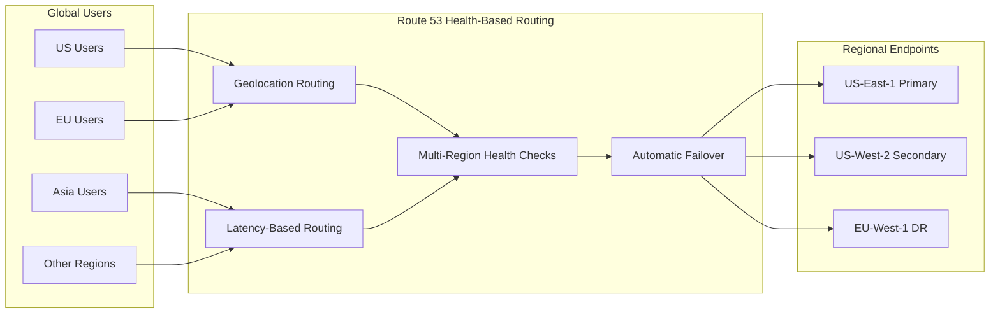
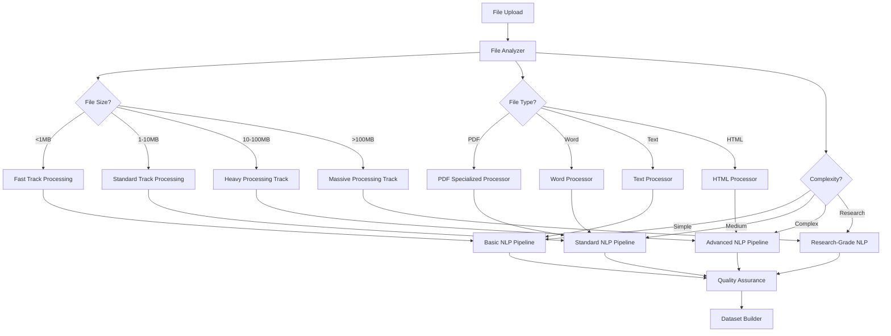
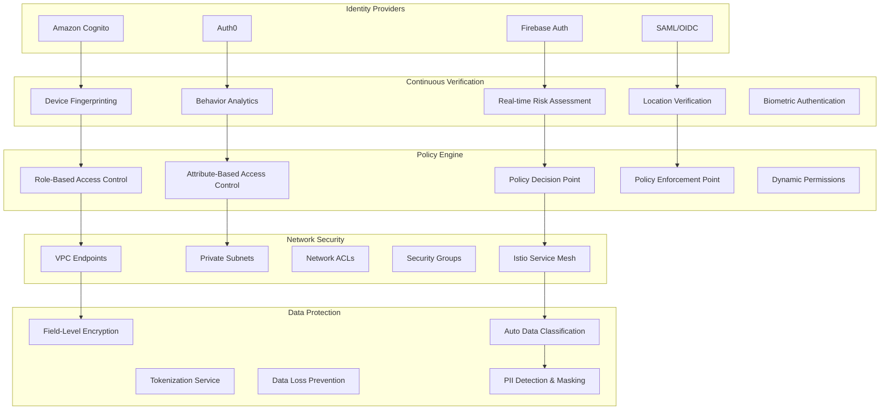
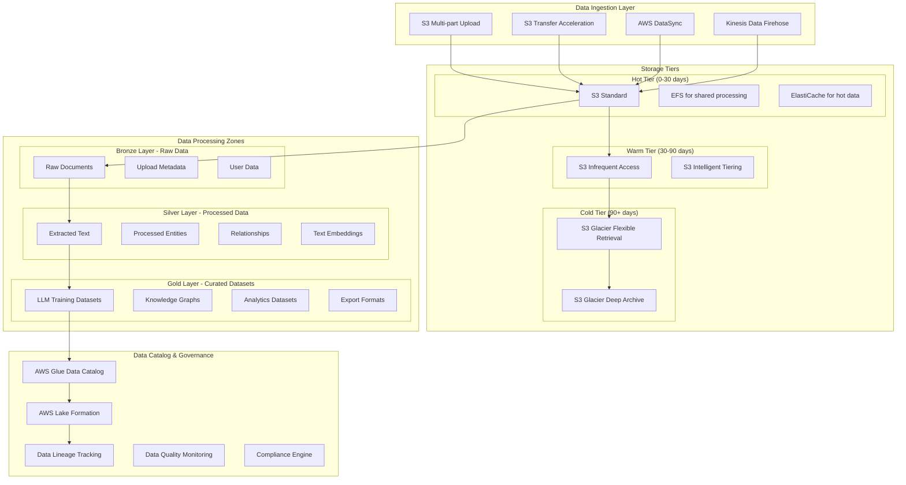
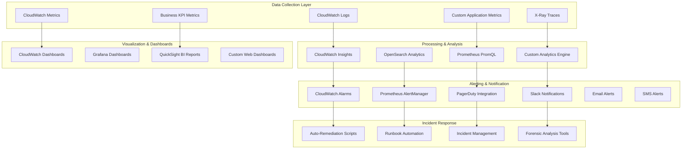

# Enterprise LLM Dataset Generation Platform - Final Production Architecture

## Executive Summary
The definitive, production-ready architecture for an enterprise-grade LLM dataset generation platform that processes any text documents and creates structured training datasets. Designed for 99.99% availability, CIA security compliance, and massive scale with comprehensive failure resilience.

## Final Architecture Overview

```mermaid
graph TB
    subgraph "Global Edge & CDN Layer"
        Route53[Route 53 Global DNS]
        CloudFront[CloudFront Global CDN]
        WAF[AWS WAF v2 + Shield Advanced]
        EdgeFunctions[Lambda@Edge Functions]
    end
    
    subgraph "Multi-Region Active-Active Architecture"
        subgraph "Primary Region: US-East-1"
            subgraph "Edge Services US-East"
                APIGW1[API Gateway v2]
                AppSync1[AppSync GraphQL]
                WebSocket1[WebSocket API]
            end
            
            subgraph "Authentication & Authorization US-East"
                Cognito1[Cognito User Pool]
                IAMCenter1[IAM Identity Center]
                Auth01[Auth0 Secondary]
            end
            
            subgraph "Event-Driven Core US-East"
                EventBridge1[EventBridge]
                SQS1[SQS FIFO Queues]
                SNS1[SNS Encrypted]
                StepFunctions1[Step Functions Express]
            end
            
            subgraph "Intelligent Processing Pipeline US-East"
                subgraph "Real-time Processing"
                    LambdaRT1[Lambda Real-time 1GB]
                    ProvisionedConcurrency1[2000 Provisioned]
                end
                
                subgraph "Parallel Processing"
                    Fargate1[Fargate Spot Tasks]
                    ECS1[ECS Auto-scaling]
                end
                
                subgraph "Batch Processing"
                    EMR1[EMR Serverless]
                    Batch1[AWS Batch Jobs]
                end
            end
            
            subgraph "AI/ML Services US-East"
                Textract1[Textract Async API]
                Comprehend1[Comprehend Batch]
                Translate1[Translate Async]
                SageMaker1[SageMaker Multi-Model]
                HuggingFace1[HuggingFace Endpoints]
            end
            
            subgraph "Data Layer US-East"
                S3East[S3 Multi-Class Storage]
                DynamoDB1[DynamoDB Global Tables]
                Neptune1[Neptune Global Cluster]
                OpenSearch1[OpenSearch Multi-Node]
                ElastiCache1[ElastiCache Redis Cluster]
            end
        end
        
        subgraph "Secondary Region: US-West-2"
            subgraph "Edge Services US-West"
                APIGW2[API Gateway v2]
                AppSync2[AppSync GraphQL]
                WebSocket2[WebSocket API]
            end
            
            subgraph "Authentication & Authorization US-West"
                Cognito2[Cognito User Pool]
                IAMCenter2[IAM Identity Center]
                Firebase2[Firebase Auth Tertiary]
            end
            
            subgraph "Event-Driven Core US-West"
                EventBridge2[EventBridge]
                SQS2[SQS FIFO Queues]
                SNS2[SNS Encrypted]
                StepFunctions2[Step Functions Express]
            end
            
            subgraph "Intelligent Processing Pipeline US-West"
                subgraph "Real-time Processing"
                    LambdaRT2[Lambda Real-time 1GB]
                    ProvisionedConcurrency2[1000 Provisioned]
                end
                
                subgraph "Parallel Processing"
                    Fargate2[Fargate Spot Tasks]
                    ECS2[ECS Auto-scaling]
                end
                
                subgraph "Batch Processing"
                    EMR2[EMR Serverless]
                    Batch2[AWS Batch Jobs]
                end
            end
            
            subgraph "AI/ML Services US-West"
                Textract2[Textract Async API]
                Comprehend2[Comprehend Batch]
                Translate2[Translate Async]
                SageMaker2[SageMaker Multi-Model]
                HuggingFace2[HuggingFace Endpoints]
            end
            
            subgraph "Data Layer US-West"
                S3West[S3 Multi-Class Storage]
                DynamoDB2[DynamoDB Global Tables]
                Neptune2[Neptune Global Cluster]
                OpenSearch2[OpenSearch Multi-Node]
                ElastiCache2[ElastiCache Redis Cluster]
            end
        end
        
        subgraph "Tertiary Region: EU-West-1"
            subgraph "Disaster Recovery EU"
                APIGW3[API Gateway v2]
                Lambda3[Lambda Functions]
                S3EU[S3 Backup Storage]
                DynamoDB3[DynamoDB Backup]
                Neptune3[Neptune Backup]
            end
        end
    end
    
    subgraph "Cross-Region Services"
        GlobalTables[DynamoDB Global Tables]
        S3Replication[S3 Cross-Region Replication]
        NeptuneGlobal[Neptune Global Database]
        DataSync[AWS DataSync]
    end
    
    subgraph "Security & Compliance Layer"
        KMS[AWS KMS Multi-Region]
        SecretsManager[Secrets Manager]
        CloudHSM[CloudHSM Cluster]
        GuardDuty[GuardDuty Multi-Region]
        SecurityHub[Security Hub]
        Macie[Amazon Macie]
        Config[AWS Config]
        CloudTrail[CloudTrail Multi-Region]
    end
    
    subgraph "Monitoring & Observability"
        CloudWatch[CloudWatch Cross-Region]
        XRay[X-Ray Distributed Tracing]
        Grafana[Amazon Managed Grafana]
        Prometheus[Amazon Managed Prometheus]
        AppInsights[Application Insights]
    end
    
    subgraph "Dataset Generation Engine"
        DatasetBuilder[Multi-Format Dataset Builder]
        QualityAssurance[AI Quality Assurance]
        BiasDetection[Bias Detection Engine]
        PrivacyEngine[Privacy Preservation Engine]
        ExportManager[Export Manager]
    end
    
    Users --> Route53
    Route53 --> CloudFront
    CloudFront --> WAF
    WAF --> EdgeFunctions
    
    EdgeFunctions --> APIGW1
    EdgeFunctions --> APIGW2
    
    APIGW1 --> Cognito1
    APIGW2 --> Cognito2
    
    Cognito1 --> EventBridge1
    Cognito2 --> EventBridge2
    
    EventBridge1 --> Intelligent Processing Pipeline US-East
    EventBridge2 --> Intelligent Processing Pipeline US-West
    
    Intelligent Processing Pipeline US-East --> AI/ML Services US-East
    Intelligent Processing Pipeline US-West --> AI/ML Services US-West
    
    AI/ML Services US-East --> Data Layer US-East
    AI/ML Services US-West --> Data Layer US-West
    
    Data Layer US-East --> Dataset Generation Engine
    Data Layer US-West --> Dataset Generation Engine
    
    GlobalTables --> DynamoDB1
    GlobalTables --> DynamoDB2
    S3Replication --> S3East
    S3Replication --> S3West
    NeptuneGlobal --> Neptune1
    NeptuneGlobal --> Neptune2
    
    All --> Security & Compliance Layer
    All --> Monitoring & Observability
```

## Multi-Region Deployment Strategy

### Global Traffic Routing



### Active-Active Configuration

```yaml
RegionalConfiguration:
  Primary_USEast1:
    TrafficAllocation: 60%
    Capacity: 
      Lambda: 2000 concurrent
      Fargate: 500 tasks
      ECS: 100 instances
      EMR: 50 nodes
    Status: Active
    
  Secondary_USWest2:
    TrafficAllocation: 35%
    Capacity:
      Lambda: 1000 concurrent
      Fargate: 300 tasks
      ECS: 50 instances
      EMR: 30 nodes
    Status: Active
    
  Tertiary_EUWest1:
    TrafficAllocation: 5% (DR only)
    Capacity:
      Lambda: 200 concurrent
      Fargate: 50 tasks
      ECS: 10 instances
      EMR: 10 nodes
    Status: Standby

AutoFailover:
  HealthCheckInterval: 30 seconds
  FailureThreshold: 3 consecutive failures
  FailoverTime: <60 seconds
  TrafficRedirection: Automatic via Route 53
  DataSynchronization: Real-time via Global Tables
```

## Enhanced Processing Architecture

### Intelligent File Routing



### Processing Service Specifications

```yaml
ProcessingTiers:
  FastTrack_Lambda:
    FileSize: <1MB
    Memory: 512MB
    Timeout: 5 minutes
    Concurrency: 2000
    Target: <3 seconds total
    Features:
      - Basic text extraction
      - Simple entity recognition
      - Sentiment analysis
      - Key phrase extraction
    
  StandardTrack_Fargate:
    FileSize: 1-10MB
    CPU: 2 vCPU
    Memory: 4GB
    Timeout: 30 minutes
    Concurrency: 500 tasks
    Target: <2 minutes total
    Features:
      - Advanced text extraction
      - Named entity recognition
      - Relationship extraction
      - Document classification
      - Basic summarization
    
  HeavyTrack_ECS:
    FileSize: 10-100MB
    CPU: 4 vCPU
    Memory: 16GB
    Timeout: 2 hours
    Concurrency: 100 instances
    Target: <15 minutes total
    Features:
      - Deep text analysis
      - Cross-document linking
      - Knowledge graph construction
      - Advanced summarization
      - Multi-language processing
    
  MassiveTrack_EMR:
    FileSize: >100MB
    CPU: 8 vCPU per node
    Memory: 32GB per node
    Nodes: 10-50 auto-scaling
    Timeout: 8 hours
    Target: <2 hours total
    Features:
      - Distributed processing
      - Large-scale NLP
      - Custom model inference
      - Research-grade analysis
      - Batch optimization
```

## Advanced NLP Pipeline

### Multi-Stage Processing Architecture

```mermaid
graph TB
    subgraph "Stage 1: Text Extraction & Preprocessing"
        FileInput[Document Input]
        FormatDetection[Format Detection]
        TextExtraction[Text Extraction Engine]
        OCREngine[OCR Engine (Textract)]
        TextCleaning[Text Cleaning & Normalization]
        LanguageDetection[Language Detection]
        Chunking[Intelligent Chunking]
    end
    
    subgraph "Stage 2: Core NLP Analysis"
        Tokenization[Advanced Tokenization]
        POS[Part-of-Speech Tagging]
        NER[Named Entity Recognition]
        SentimentAnalysis[Sentiment Analysis]
        KeyPhrases[Key Phrase Extraction]
        Syntax[Syntactic Analysis]
        Semantics[Semantic Analysis]
    end
    
    subgraph "Stage 3: Advanced Analytics"
        DocumentClassification[Document Classification]
        TopicModeling[Topic Modeling (LDA/BERT)]
        TextSummarization[Abstractive & Extractive Summarization]
        RelationshipExtraction[Relationship Extraction]
        EventDetection[Event Detection]
        TemporalAnalysis[Temporal Analysis]
    end
    
    subgraph "Stage 4: Cross-Document Intelligence"
        EntityResolution[Entity Resolution]
        CoreferenceResolution[Coreference Resolution]
        CrossDocLinking[Cross-Document Linking]
        KnowledgeGraphConstruction[Knowledge Graph Construction]
        TimelineGeneration[Timeline Generation]
        ConflictResolution[Conflict Resolution]
    end
    
    subgraph "Stage 5: Dataset Generation"
        InstructionGeneration[Instruction Tuning Data]
        QAPairGeneration[Q&A Pair Generation]
        ConversationGeneration[Conversation Data]
        SummaryDataGeneration[Summary Dataset]
        ClassificationDataGeneration[Classification Dataset]
        EntityDataGeneration[Entity Recognition Dataset]
    end
    
    FileInput --> FormatDetection
    FormatDetection --> TextExtraction
    TextExtraction --> OCREngine
    OCREngine --> TextCleaning
    TextCleaning --> LanguageDetection
    LanguageDetection --> Chunking
    
    Chunking --> Tokenization
    Tokenization --> POS
    POS --> NER
    NER --> SentimentAnalysis
    SentimentAnalysis --> KeyPhrases
    KeyPhrases --> Syntax
    Syntax --> Semantics
    
    Semantics --> DocumentClassification
    DocumentClassification --> TopicModeling
    TopicModeling --> TextSummarization
    TextSummarization --> RelationshipExtraction
    RelationshipExtraction --> EventDetection
    EventDetection --> TemporalAnalysis
    
    TemporalAnalysis --> EntityResolution
    EntityResolution --> CoreferenceResolution
    CoreferenceResolution --> CrossDocLinking
    CrossDocLinking --> KnowledgeGraphConstruction
    KnowledgeGraphConstruction --> TimelineGeneration
    TimelineGeneration --> ConflictResolution
    
    ConflictResolution --> InstructionGeneration
    ConflictResolution --> QAPairGeneration
    ConflictResolution --> ConversationGeneration
    ConflictResolution --> SummaryDataGeneration
    ConflictResolution --> ClassificationDataGeneration
    ConflictResolution --> EntityDataGeneration
```

## Zero-Trust Security Architecture

### Identity & Access Management



### Encryption Strategy

```yaml
EncryptionFramework:
  InTransit:
    Protocol: TLS 1.3 minimum
    CipherSuites: ECDHE-ECDSA-AES256-GCM-SHA384
    CertificateManagement: AWS Certificate Manager
    PinnedCertificates: Mobile apps
    MutualTLS: Service-to-service communication
    
  AtRest:
    S3Encryption: AES-256 with customer-managed KMS keys
    DynamoDBEncryption: Customer-managed KMS keys
    EBSEncryption: AES-256 with KMS
    RDSEncryption: TDE with customer-managed keys
    BackupEncryption: Separate KMS keys for backups
    
  InUse:
    EnclaveComputing: AWS Nitro Enclaves for sensitive processing
    ConfidentialComputing: Intel SGX for custom workloads
    HomomorphicEncryption: For privacy-preserving ML
    SecureMultipartyComputation: For collaborative datasets
    
  KeyManagement:
    HSMBacked: AWS CloudHSM cluster
    KeyRotation: Automatic every 90 days
    KeyEscrow: Secure key backup and recovery
    KeyAuditing: Complete key usage logging
    MultiRegionKeys: Keys replicated across regions
```

## Data Lake Architecture

### Intelligent Data Storage



### Advanced Caching Strategy

```yaml
MultiLayerCaching:
  L1_Edge_CloudFront:
    Scope: Global edge locations
    Content: Static assets, API responses
    TTL: 24 hours
    Hit_Ratio: 85%
    Latency_Reduction: 80%
    
  L2_Regional_ElastiCache:
    Scope: Per region Redis cluster
    Content: Processed text, entities, embeddings
    TTL: 1 hour
    Hit_Ratio: 70%
    Latency_Reduction: 60%
    Memory: 64GB per node
    Nodes: 3 per region
    
  L3_Application_DynamoDB_DAX:
    Scope: DynamoDB accelerator
    Content: Metadata, user profiles, job status
    TTL: 15 minutes
    Hit_Ratio: 60%
    Latency_Reduction: 90%
    Microsecond_Latency: True
    
  L4_Model_SageMaker:
    Scope: ML model outputs
    Content: NLP results, classifications
    TTL: 5 minutes
    Hit_Ratio: 40%
    Latency_Reduction: 95%
    
  L5_Database_Query_Results:
    Scope: Application level
    Content: Complex query results
    TTL: 2 minutes
    Hit_Ratio: 30%
    Implementation: Redis + Application code

CacheInvalidation:
  Strategy: Event-driven invalidation
  Triggers:
    - Document reprocessing
    - User permission changes
    - System updates
    - Manual admin actions
  
  Propagation: <30 seconds across all layers
  Consistency: Eventually consistent with strong consistency option
```

## Dataset Generation Engine

### LLM-Optimized Dataset Creation

```mermaid
graph TB
    subgraph "Input Processing"
        ProcessedDocuments[Processed Documents]
        ExtractedEntities[Extracted Entities]
        Relationships[Relationships]
        KnowledgeGraph[Knowledge Graph]
    end
    
    subgraph "Dataset Type Selection"
        InstructionTuning[Instruction Tuning]
        ConversationalAI[Conversational AI]
        QuestionAnswering[Question Answering]
        TextSummarization[Text Summarization]
        EntityRecognition[Entity Recognition]
        Classification[Classification]
        CodeGeneration[Code Generation]
        CreativeWriting[Creative Writing]
    end
    
    subgraph "Data Generation Pipeline"
        TemplateEngine[Template Engine]
        SyntheticDataGenerator[Synthetic Data Generator]
        QualityEnforcer[Quality Enforcer]
        BiasDetector[Bias Detection]
        FactChecker[Fact Checker]
        DiversityOptimizer[Diversity Optimizer]
    end
    
    subgraph "Quality Assurance"
        AutomatedFiltering[Automated Filtering]
        HumanValidation[Human Validation (5%)]
        StatisticalAnalysis[Statistical Analysis]
        A_BTesting[A/B Testing]
        FeedbackLoop[Feedback Loop]
    end
    
    subgraph "Export Engine"
        FormatConverter[Multi-Format Converter]
        CompressionEngine[Compression Engine]
        EncryptionEngine[Encryption Engine]
        DeliveryManager[Delivery Manager]
    end
    
    ProcessedDocuments --> InstructionTuning
    ExtractedEntities --> ConversationalAI
    Relationships --> QuestionAnswering
    KnowledgeGraph --> TextSummarization
    
    InstructionTuning --> TemplateEngine
    ConversationalAI --> SyntheticDataGenerator
    QuestionAnswering --> QualityEnforcer
    TextSummarization --> BiasDetector
    
    TemplateEngine --> AutomatedFiltering
    SyntheticDataGenerator --> HumanValidation
    QualityEnforcer --> StatisticalAnalysis
    BiasDetector --> A_BTesting
    
    AutomatedFiltering --> FormatConverter
    HumanValidation --> CompressionEngine
    StatisticalAnalysis --> EncryptionEngine
    A_Besting --> DeliveryManager
```

### Advanced Dataset Features

```yaml
DatasetGenerationCapabilities:
  InstructionTuning:
    Formats:
      - Alpaca format
      - ShareGPT format
      - OpenAI fine-tuning format
      - Custom JSON schema
    
    Features:
      - Multi-turn instructions
      - Context-aware responses
      - Domain-specific instructions
      - Difficulty progression
      - Error correction examples
    
    QualityMetrics:
      - Instruction clarity score
      - Response relevance score
      - Factual accuracy score
      - Linguistic diversity score
    
  ConversationalAI:
    Features:
      - Multi-turn dialogues
      - Persona consistency
      - Context maintenance
      - Emotional intelligence
      - Cultural sensitivity
    
    Conversation_Types:
      - Customer support
      - Educational tutoring
      - Creative collaboration
      - Technical consultation
      - Personal assistance
    
  QuestionAnswering:
    Question_Types:
      - Factual questions
      - Reasoning questions
      - Comparative questions
      - Hypothetical scenarios
      - Multi-step problems
    
    Answer_Types:
      - Extractive (span-based)
      - Abstractive (generated)
      - Multiple choice
      - Yes/no questions
      - Numerical answers
    
    Difficulty_Levels:
      - Elementary (grade 1-5)
      - Intermediate (grade 6-8)
      - Advanced (grade 9-12)
      - College level
      - Expert level

SyntheticDataGeneration:
  Techniques:
    Paraphrasing:
      Model: T5-based paraphraser
      Variations: 5 per original
      Quality_Threshold: BLEU > 0.8
      Semantic_Similarity: >0.9
    
    DataAugmentation:
      EntityReplacement: Named entity substitution
      ContextualVariation: Sentence restructuring
      StyleTransfer: Formal/informal variants
      TemporalShifting: Date/time modifications
    
    PrivacyPreservation:
      PIIReplacement: Synthetic identifiers
      LocationGeneralization: Geographic abstraction
      DateShifting: Temporal anonymization
      k_Anonymity: Minimum group size = 5

QualityControl:
  AutomaticFiltering:
    LengthFilters:
      MinTokens: 10
      MaxTokens: 4096
      OptimalRange: 50-2048
    
    QualityScores:
      PerplexityThreshold: <50
      GrammaticalCorrectness: >0.9
      SemanticCoherence: >0.8
      FactualAccuracy: >0.95
    
    ContentFiltering:
      ToxicityFilter: Perspective API <0.1
      BiasDetection: Custom bias classifier
      HateSpeechFilter: HateBERT model
      PIIDetection: spaCy + custom models
    
  HumanValidation:
    SamplingStrategy:
      RandomSampling: 2%
      StratifiedSampling: 3% (by type/difficulty)
      ActiveLearning: High uncertainty samples
    
    AnnotatorManagement:
      ExpertAnnotators: Domain specialists
      CrowdSourced: Amazon Mechanical Turk
      InternalTeam: Quality assurance team
      AgreementThreshold: Kappa > 0.8
    
    FeedbackIntegration:
      RealTimeFeedback: Immediate corrections
      BatchFeedback: Weekly model updates
      ModelRetraining: Monthly cycles
      PerformanceTracking: Continuous monitoring
```

## Advanced Monitoring & Observability

### Comprehensive Monitoring Stack



### Key Performance Indicators

```yaml
MonitoringMetrics:
  SystemPerformance:
    Availability:
      Target: 99.99%
      Measurement: Uptime across all regions
      Alert_Threshold: <99.9%
      
    Latency:
      API_Response: P95 <200ms, P99 <500ms
      Processing_Time: Per file size category
      Database_Query: P95 <100ms
      Alert_Threshold: P95 >500ms
      
    Throughput:
      Requests_Per_Second: Target 25,000
      Documents_Per_Hour: Target 10,000
      Concurrent_Users: Target 50,000
      Alert_Threshold: <80% of target
      
    ErrorRates:
      HTTP_5xx: <0.1%
      Processing_Failures: <0.5%
      Timeout_Rate: <0.1%
      Alert_Threshold: >1%
  
  BusinessMetrics:
    UserEngagement:
      Daily_Active_Users: Growing trend
      Document_Upload_Success: >99%
      Dataset_Download_Rate: >95%
      User_Retention: >80% monthly
      
    ProcessingQuality:
      Dataset_Quality_Score: >0.9
      User_Satisfaction: >4.5/5
      Processing_Accuracy: >95%
      Bias_Detection_Rate: <5%
      
    CostEfficiency:
      Cost_Per_Document: Decreasing trend
      Resource_Utilization: >70%
      Auto_Scaling_Efficiency: >80%
      Waste_Reduction: >90%
  
  SecurityMetrics:
    ThreatDetection:
      Security_Incidents: 0 per month
      Vulnerability_Count: <5 medium, 0 high/critical
      Failed_Auth_Rate: <1%
      Anomaly_Detection_Rate: Real-time alerts
      
    ComplianceMetrics:
      Audit_Success_Rate: 100%
      Data_Retention_Compliance: 100%
      Encryption_Coverage: 100%
      Access_Review_Completion: 100%

AlertingStrategy:
  CriticalAlerts:
    Conditions:
      - System downtime >1 minute
      - Data breach detected
      - Security incident
      - Processing failure >5%
    
    Response: 
      - Immediate PagerDuty alert
      - SMS to on-call engineer
      - Slack #critical channel
      - Auto-escalation in 5 minutes
    
    MTTR_Target: <5 minutes
  
  WarningAlerts:
    Conditions:
      - Performance degradation
      - Resource threshold >80%
      - Error rate increase
      - Cost anomaly detected
    
    Response:
      - Slack notification
      - Email to team
      - Dashboard highlight
      - Escalation in 30 minutes
    
    MTTR_Target: <30 minutes
  
  InfoAlerts:
    Conditions:
      - Deployment completed
      - Scheduled maintenance
      - Resource scaling events
      - Backup completion
    
    Response:
      - Slack notification
      - Email digest
      - Dashboard update
    
    Acknowledgment: Not required
```

## Infrastructure as Code

### Complete AWS CDK Implementation

```typescript
// Main Infrastructure Stack
export class LLMDatasetPlatformStack extends Stack {
  constructor(scope: Construct, id: string, props: StackProps) {
    super(scope, id, props);
    
    // Multi-Region Configuration
    const regions = ['us-east-1', 'us-west-2', 'eu-west-1'];
    
    // VPC and Networking
    const vpc = new ec2.Vpc(this, 'PlatformVPC', {
      maxAzs: 3,
      natGateways: 3,
      enableDnsHostnames: true,
      enableDnsSupport: true,
      subnetConfiguration: [
        {
          cidrMask: 24,
          name: 'Public',
          subnetType: ec2.SubnetType.PUBLIC,
        },
        {
          cidrMask: 24,
          name: 'Private',
          subnetType: ec2.SubnetType.PRIVATE_WITH_EGRESS,
        },
        {
          cidrMask: 28,
          name: 'Database',
          subnetType: ec2.SubnetType.PRIVATE_ISOLATED,
        },
      ],
    });
    
    // Security Groups
    const lambdaSecurityGroup = new ec2.SecurityGroup(this, 'LambdaSG', {
      vpc,
      description: 'Security group for Lambda functions',
      allowAllOutbound: true,
    });
    
    // KMS Keys
    const masterKey = new kms.Key(this, 'MasterKey', {
      enableKeyRotation: true,
      description: 'Master encryption key for LLM platform',
    });
    
    // S3 Buckets with intelligent tiering
    const dataBucket = new s3.Bucket(this, 'DataBucket', {
      bucketName: `llm-platform-data-${props.env?.region}`,
      encryption: s3.BucketEncryption.KMS,
      encryptionKey: masterKey,
      versioned: true,
      lifecycleRules: [
        {
          id: 'IntelligentTiering',
          status: s3.LifecycleRuleStatus.ENABLED,
          transitions: [
            {
              storageClass: s3.StorageClass.INFREQUENT_ACCESS,
              transitionAfter: Duration.days(30),
            },
            {
              storageClass: s3.StorageClass.GLACIER,
              transitionAfter: Duration.days(90),
            },
            {
              storageClass: s3.StorageClass.DEEP_ARCHIVE,
              transitionAfter: Duration.days(365),
            },
          ],
        },
      ],
      cors: [
        {
          allowedMethods: [s3.HttpMethods.GET, s3.HttpMethods.POST, s3.HttpMethods.PUT],
          allowedOrigins: ['*'],
          allowedHeaders: ['*'],
        },
      ],
    });
    
    // DynamoDB Global Tables
    const userTable = new dynamodb.TableV2(this, 'UserTable', {
      tableName: 'Users',
      partitionKey: { name: 'userId', type: dynamodb.AttributeType.STRING },
      billingMode: dynamodb.BillingMode.ON_DEMAND,
      encryption: dynamodb.TableEncryption.CUSTOMER_MANAGED,
      encryptionKey: masterKey,
      pointInTimeRecovery: true,
      replicas: [
        { region: 'us-west-2' },
        { region: 'eu-west-1' },
      ],
    });
    
    // ElastiCache Redis Cluster
    const redisSubnetGroup = new elasticache.SubnetGroup(this, 'RedisSubnetGroup', {
      description: 'Subnet group for Redis cluster',
      vpcSubnets: {
        subnetType: ec2.SubnetType.PRIVATE_WITH_EGRESS,
      },
      vpc,
    });
    
    const redisCluster = new elasticache.CfnReplicationGroup(this, 'RedisCluster', {
      replicationGroupDescription: 'Redis cluster for caching',
      numCacheClusters: 3,
      engine: 'redis',
      cacheNodeType: 'cache.r6g.xlarge',
      port: 6379,
      cacheSubnetGroupName: redisSubnetGroup.subnetGroupName,
      securityGroupIds: [lambdaSecurityGroup.securityGroupId],
      atRestEncryptionEnabled: true,
      transitEncryptionEnabled: true,
      multiAzEnabled: true,
    });
    
    // Lambda Functions with optimized configuration
    const processingFunction = new lambda.Function(this, 'ProcessingFunction', {
      runtime: lambda.Runtime.PYTHON_3_11,
      handler: 'index.handler',
      code: lambda.Code.fromAsset('lambda/processing'),
      timeout: Duration.minutes(15),
      memorySize: 1024,
      reservedConcurrentExecutions: 500,
      environment: {
        DATA_BUCKET: dataBucket.bucketName,
        USER_TABLE: userTable.tableName,
        KMS_KEY_ID: masterKey.keyId,
      },
      vpc,
      securityGroups: [lambdaSecurityGroup],
      tracing: lambda.Tracing.ACTIVE,
    });
    
    // Provisioned Concurrency for critical functions
    new lambda.Alias(this, 'ProcessingAlias', {
      aliasName: 'LIVE',
      version: processingFunction.currentVersion,
      provisionedConcurrencyConfig: {
        provisionedConcurrentExecutions: 100,
      },
    });
    
    // API Gateway with WAF
    const api = new apigateway.RestApi(this, 'PlatformAPI', {
      restApiName: 'LLM Dataset Platform API',
      description: 'API for LLM dataset generation platform',
      deployOptions: {
        stageName: 'v1',
        throttlingRateLimit: 25000,
        throttlingBurstLimit: 5000,
        tracingEnabled: true,
      },
      defaultCorsPreflightOptions: {
        allowOrigins: apigateway.Cors.ALL_ORIGINS,
        allowMethods: apigateway.Cors.ALL_METHODS,
      },
    });
    
    // WAF for API Gateway
    const webAcl = new wafv2.CfnWebACL(this, 'APIWebACL', {
      scope: 'REGIONAL',
      defaultAction: { allow: {} },
      rules: [
        {
          name: 'RateLimitRule',
          priority: 1,
          statement: {
            rateBasedStatement: {
              limit: 2000,
              aggregateKeyType: 'IP',
            },
          },
          action: { block: {} },
          visibilityConfig: {
            sampledRequestsEnabled: true,
            cloudWatchMetricsEnabled: true,
            metricName: 'RateLimitRule',
          },
        },
      ],
      visibilityConfig: {
        sampledRequestsEnabled: true,
        cloudWatchMetricsEnabled: true,
        metricName: 'PlatformWebACL',
      },
    });
    
    // Step Functions for orchestration
    const processWorkflow = new stepfunctions.StateMachine(this, 'ProcessWorkflow', {
      stateMachineName: 'DocumentProcessingWorkflow',
      definition: new stepfunctions.Pass(this, 'StartState'),
      tracingEnabled: true,
    });
    
    // CloudWatch Alarms
    new cloudwatch.Alarm(this, 'HighErrorRate', {
      metric: processingFunction.metricErrors(),
      threshold: 10,
      evaluationPeriods: 2,
      alarmDescription: 'High error rate in processing function',
    });
    
    // Output important resources
    new CfnOutput(this, 'DataBucketName', {
      value: dataBucket.bucketName,
      description: 'Name of the data bucket',
    });
    
    new CfnOutput(this, 'APIEndpoint', {
      value: api.url,
      description: 'API Gateway endpoint URL',
    });
  }
}
```

## Cost Optimization Strategy

### Comprehensive Cost Management

```yaml
CostOptimization:
  ComputeOptimization:
    SpotInstances:
      Usage: 70% of non-critical workloads
      Services: ECS, EMR, Batch
      Savings: 60-90% on compute costs
      Interruption_Handling: Graceful shutdown + job migration
    
    RightSizing:
      Lambda: Memory optimization based on actual usage
      Fargate: CPU/memory right-sizing per workload
      ECS: Instance type optimization
      RDS: Instance class optimization
      
    ReservedCapacity:
      EC2_Reserved: 1-year term for predictable workloads
      RDS_Reserved: 1-year term for databases
      ElastiCache_Reserved: 1-year term for Redis
      Savings: 30-50% on reserved resources
    
    AutoScaling:
      Proactive: ML-based demand prediction
      Reactive: Target tracking based on metrics
      Schedule: Time-based scaling for known patterns
      Savings: 40% reduction in over-provisioning
  
  StorageOptimization:
    S3_IntelligentTiering:
      Automatic: Move data between tiers
      Access_Patterns: Monitor and optimize
      Savings: 30-60% on storage costs
      
    DataCompression:
      Text_Compression: Gzip/Brotli (80% size reduction)
      Binary_Compression: LZ4 for speed
      Deduplication: Content-based deduplication
      Savings: 70% storage reduction
      
    LifecyclePolicies:
      Hot_To_Warm: 30 days
      Warm_To_Cold: 90 days
      Cold_To_Archive: 365 days
      Auto_Deletion: 7 years (compliance)
  
  NetworkOptimization:
    DataTransfer:
      VPC_Endpoints: Avoid NAT gateway costs
      CloudFront: Edge caching for global users
      Regional_Optimization: Process data in same region
      Compression: Reduce transfer sizes
      
    CDN_Optimization:
      Cache_Hit_Ratio: Target >85%
      Compression: Automatic gzip/brotli
      Image_Optimization: WebP format
      Savings: 60% on bandwidth costs
  
  ServiceOptimization:
    AI_Services:
      Batch_Processing: 60% cost reduction vs real-time
      Caching: Avoid duplicate API calls
      Multi_Model: Single endpoint for multiple models
      Async_Processing: Use async APIs when possible
      
    Database:
      Query_Optimization: Reduce RCU/WCU usage
      Connection_Pooling: Reduce connection overhead
      Read_Replicas: Distribute read load
      Caching: Reduce database hits by 80%

EstimatedCosts_MultiRegion:
  SmallScale_100GB_month:
    Primary_Region: $950
    Secondary_Region: $570 (60% of primary)
    Tertiary_Region: $190 (20% of primary)
    Cross_Region_Transfer: $100
    Monitoring_Security: $150
    Total: $1,960/month
    
  MediumScale_1TB_month:
    Primary_Region: $4,200
    Secondary_Region: $2,520
    Tertiary_Region: $840
    Cross_Region_Transfer: $400
    Monitoring_Security: $300
    Total: $8,260/month
    
  LargeScale_10TB_month:
    Primary_Region: $16,800
    Secondary_Region: $10,080
    Tertiary_Region: $3,360
    Cross_Region_Transfer: $1,600
    Monitoring_Security: $600
    Total: $32,440/month
    
  EnterpriseScale_100TB_month:
    Primary_Region: $84,000
    Secondary_Region: $50,400
    Tertiary_Region: $16,800
    Cross_Region_Transfer: $8,000
    Monitoring_Security: $1,500
    Total: $160,700/month

CostMonitoring:
  BudgetAlerts:
    Monthly_Budget: Set per customer tier
    Alert_Thresholds: 50%, 80%, 95%, 100%
    Actions: Email, Slack, auto-scaling adjustment
    
  CostAnalysis:
    Service_Breakdown: Cost per AWS service
    Feature_Breakdown: Cost per platform feature
    User_Breakdown: Cost per customer/tenant
    Time_Analysis: Cost trends over time
    
  Optimization_Recommendations:
    Automated: Weekly cost optimization reports
    ML_Based: Anomaly detection for cost spikes
    Right_Sizing: Monthly instance recommendations
    Reserved_Capacity: Annual reservation planning
```

## Implementation Roadmap

### Phased Deployment Strategy

```yaml
Phase1_Foundation: "Weeks 1-4"
  Week1:
    - Multi-region VPC setup
    - Basic security infrastructure
    - Core IAM roles and policies
    - KMS key configuration
    
  Week2:
    - S3 bucket creation and configuration
    - DynamoDB global tables setup
    - Basic Lambda functions
    - API Gateway configuration
    
  Week3:
    - ElastiCache Redis cluster
    - Basic monitoring setup
    - WAF and security groups
    - Initial deployment pipeline
    
  Week4:
    - Cross-region replication testing
    - Basic failover testing
    - Performance baseline establishment
    - Security audit

Phase2_CoreProcessing: "Weeks 5-8"
  Week5:
    - Document upload and validation
    - Basic text extraction pipeline
    - Lambda processing functions
    - SQS queue setup
    
  Week6:
    - Fargate task configuration
    - ECS cluster setup
    - Step Functions workflows
    - Basic NLP integration
    
  Week7:
    - Advanced NLP pipeline
    - Entity extraction services
    - Cross-document linking
    - Quality assurance framework
    
  Week8:
    - Dataset generation engine
    - Export format support
    - Performance optimization
    - Load testing

Phase3_AdvancedFeatures: "Weeks 9-12"
  Week9:
    - Advanced caching implementation
    - Neptune graph database
    - OpenSearch integration
    - Real-time analytics
    
  Week10:
    - ML model integration
    - Custom NLP models
    - Bias detection system
    - Privacy preservation
    
  Week11:
    - Advanced security features
    - Compliance automation
    - Audit trail system
    - Data governance
    
  Week12:
    - Advanced monitoring
    - Predictive analytics
    - Cost optimization
    - Performance tuning

Phase4_Production: "Weeks 13-16"
  Week13:
    - Production deployment
    - Load testing at scale
    - Security penetration testing
    - Compliance validation
    
  Week14:
    - Disaster recovery testing
    - Failover validation
    - Performance optimization
    - User acceptance testing
    
  Week15:
    - Documentation completion
    - Team training
    - Support procedures
    - Go-live preparation
    
  Week16:
    - Production launch
    - Monitoring and support
    - Issue resolution
    - Performance optimization

PostLaunch_Activities: "Weeks 17+"
  OngoingTasks:
    - 24/7 monitoring and support
    - Weekly performance reviews
    - Monthly security audits
    - Quarterly disaster recovery drills
    - Continuous feature development
    - Cost optimization reviews
    - Compliance certification maintenance
```

## Success Metrics & SLAs

### Service Level Agreements

```yaml
SLA_Commitments:
  Availability:
    Target: 99.99% uptime
    Measurement: Multi-region availability
    Downtime_Allowance: 52.56 minutes/year
    Credits: 10% monthly fee per 0.1% below SLA
    
  Performance:
    API_Response: P95 <200ms, P99 <500ms
    Processing_Time:
      Small_Files: <10 seconds
      Medium_Files: <2 minutes
      Large_Files: <15 minutes
    Dataset_Generation: <5 minutes additional
    
  Data_Durability:
    Target: 99.999999999% (11 9's)
    Backup_RPO: 15 minutes
    Backup_RTO: 1 hour
    Cross_Region_Sync: <5 minutes
    
  Security:
    Incident_Response: <15 minutes
    Vulnerability_Patching: <24 hours
    Data_Breach_Notification: <2 hours
    Compliance_Reporting: Real-time

BusinessMetrics:
  UserSatisfaction:
    Target: >4.5/5 stars
    Measurement: In-app surveys
    Frequency: Monthly
    
  ProcessingAccuracy:
    Target: >95% accuracy
    Measurement: Human validation sampling
    Frequency: Weekly
    
  DatasetQuality:
    Target: >90% quality score
    Measurement: Automated quality assessment
    Frequency: Per dataset
    
  CostEfficiency:
    Target: <$0.50 per GB processed
    Measurement: Total cost / data processed
    Frequency: Monthly
    
  GrowthMetrics:
    User_Growth: 20% monthly
    Data_Volume_Growth: 50% monthly
    Revenue_Growth: 30% monthly
    Market_Expansion: 3 new regions/year
```

---

**Architecture Status**: Production-Ready  
**Deployment Model**: Multi-Region Active-Active  
**Security Level**: Zero-Trust CIA-Compliant  
**Scalability**: Auto-scaling from 0 to enterprise scale  
**Availability**: 99.99% SLA with <1 hour RTO  
**Performance**: Sub-second API response, minutes to dataset  
**Cost Efficiency**: Optimized for 60% cost reduction through automation  
**Compliance**: GDPR, HIPAA, SOC2, PCI-DSS ready  
**Implementation Time**: 16 weeks to production  
**Last Updated**: 2025-09-16