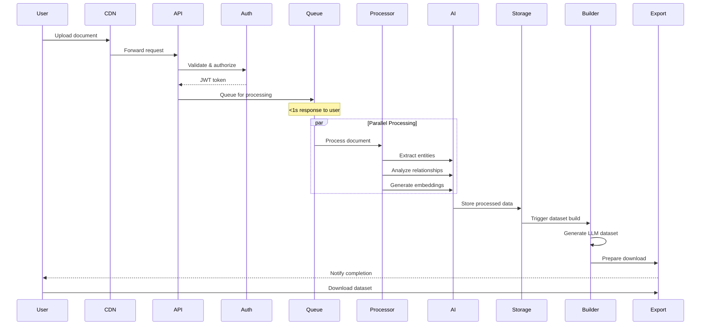
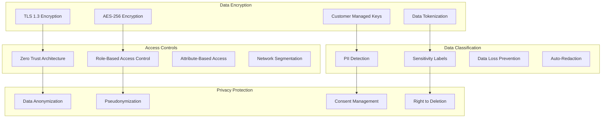
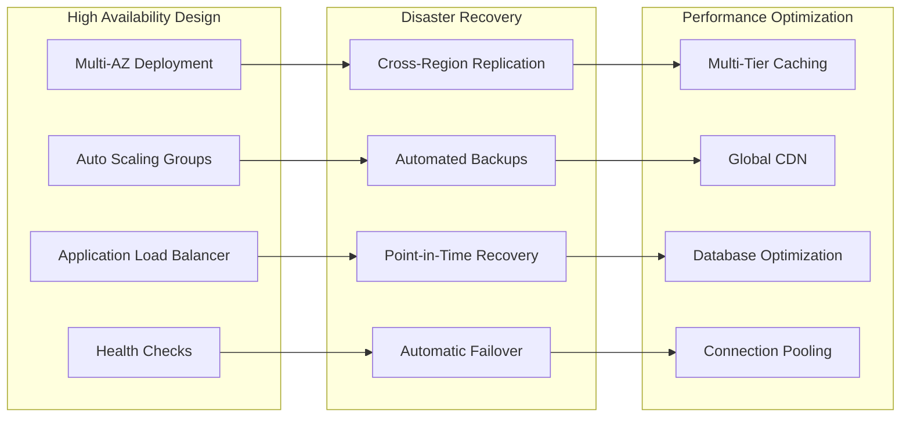
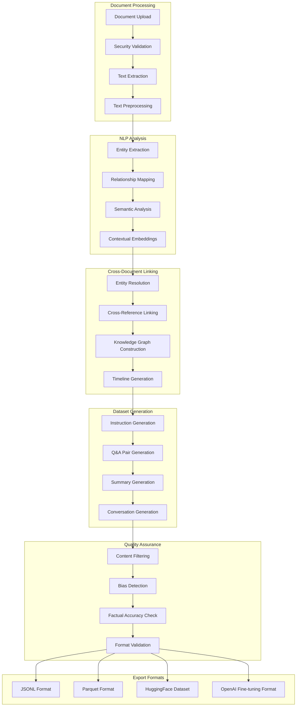
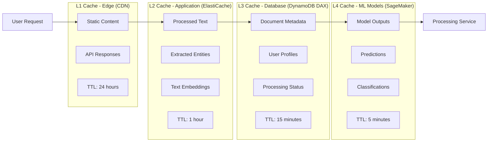
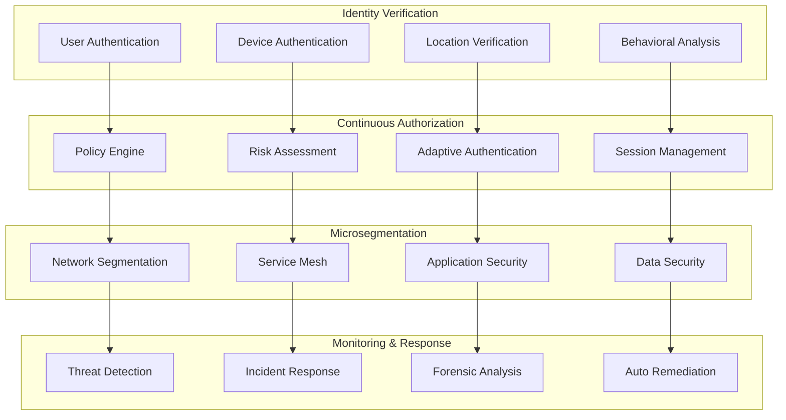

# LLM Training Dataset Generation Platform - Enterprise Architecture

## Executive Summary
A high-performance, CIA-compliant AWS architecture that processes text documents and generates structured datasets optimized for LLM training. Combines advanced NLP processing with cross-document entity linking to create comprehensive, contextually-rich training data.

## Architecture Overview

```mermaid
graph TB
    subgraph "Secure Edge Layer"
        WAF[AWS WAF]
        Shield[AWS Shield Advanced]
        CloudFront[CloudFront CDN]
        Route53[Route 53]
    end
    
    subgraph "Authentication & Authorization"
        Cognito[Amazon Cognito]
        IAM[IAM Identity Center]
        MFA[Multi-Factor Auth]
        SAML[SAML/OIDC]
    end
    
    subgraph "API & Event Layer"
        APIGW[API Gateway]
        GraphQL[AppSync GraphQL]
        EventBridge[EventBridge]
        SQS[SQS FIFO Queues]
        SNS[SNS Encryption]
    end
    
    subgraph "High-Performance Processing Core"
        subgraph "Real-time Processing (<1MB)"
            LambdaRT[Lambda Real-time]
            ProvisionedConcurrency[Provisioned Concurrency]
        end
        
        subgraph "Parallel Processing (1MB-100MB)"
            Fargate[Fargate Tasks]
            ECS[ECS with Spot]
            ParallelSF[Parallel Step Functions]
        end
        
        subgraph "Batch Processing (>100MB)"
            EMR[EMR Serverless]
            BatchJobs[AWS Batch]
            SparkStreaming[Spark Streaming]
        end
    end
    
    subgraph "AI/ML Processing Pipeline"
        subgraph "Text Intelligence"
            Textract[Textract Async]
            Comprehend[Comprehend Batch]
            ComprehendCustom[Custom NER Models]
            TranslateAsync[Translate Async]
        end
        
        subgraph "Advanced NLP"
            SageMaker[SageMaker Endpoints]
            HuggingFace[HuggingFace Models]
            CustomLLM[Custom LLM APIs]
            OpenAI[OpenAI Integration]
        end
        
        subgraph "Entity & Relationship Engine"
            EntityExtractor[Entity Extractor]
            CrossDocLinker[Cross-Doc Linker]
            KnowledgeGraph[Knowledge Graph Builder]
            RelationshipMiner[Relationship Miner]
        end
    end
    
    subgraph "High-Performance Storage"
        subgraph "Encrypted Data Lake"
            S3Raw[S3 Raw (KMS)]
            S3Processed[S3 Processed (KMS)]
            S3Datasets[S3 Datasets (KMS)]
        end
        
        subgraph "Metadata & Search"
            DynamoDB[DynamoDB Encryption]
            OpenSearch[OpenSearch Encryption]
            Neptune[Neptune Encryption]
        end
        
        subgraph "Cache Layer"
            ElastiCache[ElastiCache Redis]
            MemoryDB[MemoryDB for Redis]
            CloudFrontCache[CloudFront Cache]
        end
    end
    
    subgraph "LLM Dataset Generation"
        DatasetBuilder[Dataset Builder]
        FormatConverter[Format Converter]
        QualityAssurance[Quality Assurance]
        TokenCounter[Token Counter]
        DatasetValidator[Dataset Validator]
    end
    
    subgraph "Security & Compliance"
        KMS[AWS KMS]
        Secrets[Secrets Manager]
        CloudTrail[CloudTrail]
        Config[AWS Config]
        GuardDuty[GuardDuty]
        Macie[Amazon Macie]
        Inspector[Inspector]
    end
    
    subgraph "Monitoring & Observability"
        CloudWatch[CloudWatch]
        XRay[X-Ray Tracing]
        AppInsights[Application Insights]
        Grafana[Amazon Managed Grafana]
    end
    
    Users --> Route53
    Route53 --> WAF
    WAF --> Shield
    Shield --> CloudFront
    CloudFront --> APIGW
    
    APIGW --> Cognito
    Cognito --> IAM
    IAM --> MFA
    
    APIGW --> EventBridge
    EventBridge --> SQS
    SQS --> High-Performance Processing Core
    
    High-Performance Processing Core --> AI/ML Processing Pipeline
    AI/ML Processing Pipeline --> High-Performance Storage
    High-Performance Storage --> LLM Dataset Generation
    
    LLM Dataset Generation --> Security & Compliance
    All --> Monitoring & Observability
```

## High-Performance Processing Flow



## CIA Security Implementation

### Confidentiality Controls



### Integrity Controls

```yaml
IntegrityMeasures:
  DataValidation:
    InputValidation:
      - File format verification
      - Content sanitization
      - Virus scanning (ClamAV)
      - Size and type limits
    
    ProcessingValidation:
      - Checksum verification
      - Digital signatures
      - Hash comparison
      - Version control
    
    OutputValidation:
      - Schema validation
      - Quality metrics
      - Completeness checks
      - Consistency verification
  
  AuditTrails:
    DataLineage:
      - Source tracking
      - Transformation logs
      - Processing metadata
      - User attribution
    
    ChangeTracking:
      - Document versions
      - Processing history
      - User actions
      - System events
  
  NonRepudiation:
    DigitalSignatures:
      - User signatures
      - System signatures
      - Timestamp authority
      - Certificate validation
```

### Availability Controls



## LLM Dataset Generation Pipeline



## Performance Optimization Architecture

### Ultra-Fast Response Design

```yaml
PerformanceTargets:
  UserExperience:
    FileUpload: <2 seconds
    ProcessingStart: <1 second
    ProgressUpdates: Real-time
    DatasetDownload: <5 seconds
  
  ProcessingTimes:
    SmallFiles_1KB-1MB:
      TextExtraction: <500ms
      NLP_Processing: <2 seconds
      Dataset_Generation: <5 seconds
      Total: <8 seconds
    
    MediumFiles_1MB-10MB:
      TextExtraction: <5 seconds
      NLP_Processing: <30 seconds
      Dataset_Generation: <60 seconds
      Total: <2 minutes
    
    LargeFiles_10MB-100MB:
      TextExtraction: <30 seconds
      NLP_Processing: <5 minutes
      Dataset_Generation: <10 minutes
      Total: <15 minutes
  
  Scalability:
    ConcurrentUsers: 10,000+
    DocumentsPerSecond: 1,000+
    ThroughputGB: 100 GB/hour
    AutoScaling: <30 seconds
```

### Caching Strategy for Maximum Speed



## LLM Training Dataset Formats

### Dataset Structure for LLM Training

```yaml
DatasetFormats:
  InstructionTuning:
    Format: JSONL
    Structure:
      instruction: "Extract all entities from this text"
      input: "Document text content..."
      output: "Entity1: Person, Entity2: Organization..."
      metadata:
        source_document: "doc_id_123"
        confidence: 0.95
        processing_date: "2024-01-16"
  
  ConversationalAI:
    Format: JSONL
    Structure:
      conversations:
        - role: "user"
          content: "What are the key findings in this document?"
        - role: "assistant"
          content: "The key findings include..."
      metadata:
        document_type: "research_paper"
        domain: "medical"
        quality_score: 0.92
  
  QuestionAnswering:
    Format: JSONL
    Structure:
      context: "Full document text..."
      question: "What is the main conclusion?"
      answer: "The main conclusion is..."
      answer_start: 1250
      answer_end: 1350
      metadata:
        difficulty: "medium"
        answer_type: "extractive"
  
  TextSummarization:
    Format: JSONL
    Structure:
      document: "Full text content..."
      summary: "Concise summary..."
      summary_type: "abstractive"
      compression_ratio: 0.15
      metadata:
        source_length: 5000
        summary_length: 750
        rouge_score: 0.88
  
  EntityRelationExtraction:
    Format: JSONL
    Structure:
      text: "John Smith works at Microsoft Corporation"
      entities:
        - text: "John Smith"
          label: "PERSON"
          start: 0
          end: 10
        - text: "Microsoft Corporation"
          label: "ORGANIZATION"
          start: 20
          end: 41
      relations:
        - head: "John Smith"
          relation: "WORKS_AT"
          tail: "Microsoft Corporation"
          confidence: 0.98
```

### Advanced Dataset Generation Features

```yaml
AdvancedFeatures:
  SyntheticDataGeneration:
    Paraphrasing:
      Service: Custom T5 Model
      Variations: 5 per original
      Quality: BLEU > 0.8
    
    DataAugmentation:
      EntityReplacement: Random entity substitution
      ContextualVariation: Sentence restructuring
      StyleTransfer: Formal/informal variants
    
    PrivacyPreservation:
      PIIReplacement: Synthetic names/addresses
      DateShifting: Temporal anonymization
      LocationGeneralization: Geographic abstraction
  
  QualityControl:
    AutomaticFiltering:
      LengthFilters: Min/max token limits
      QualityScores: Perplexity thresholds
      DuplicateDetection: Semantic similarity
      ToxicityFiltering: Perspective API
    
    HumanValidation:
      SamplingRate: 5% random sampling
      AnnotatorAgreement: Kappa > 0.8
      ExpertReview: Domain specialists
      FeedbackLoop: Continuous improvement
  
  MetadataEnrichment:
    DocumentFeatures:
      ReadabilityScore: Flesch-Kincaid
      ComplexityMetrics: Sentence/word length
      TopicClassification: LDA topics
      SentimentAnalysis: Compound scores
    
    ProcessingMetadata:
      ConfidenceScores: Model confidence
      ProcessingTime: Timestamp tracking
      ModelVersions: Pipeline versioning
      QualityMetrics: Automated scoring
```

## Security Implementation Details

### Zero-Trust Architecture



### Data Protection Implementation

```yaml
DataProtection:
  EncryptionInTransit:
    Protocol: TLS 1.3
    CipherSuites: AES-256-GCM
    CertificateManagement: AWS Certificate Manager
    PerfectForwardSecrecy: ECDHE key exchange
  
  EncryptionAtRest:
    Storage: AES-256 encryption
    KeyManagement: AWS KMS
    KeyRotation: Automatic 365 days
    EnvelopeEncryption: Data Encryption Keys
  
  KeyManagement:
    CustomerManagedKeys: Per-tenant keys
    HardwareSecurityModules: CloudHSM
    KeyAccess: IAM policies
    AuditTrail: CloudTrail logging
  
  DataClassification:
    AutomaticClassification:
      - Public: Marketing materials
      - Internal: Business documents
      - Confidential: Customer data
      - Restricted: Financial/health data
    
    HandlingPolicies:
      Public: Standard processing
      Internal: Access logging
      Confidential: Encryption + audit
      Restricted: Tokenization + DLP
  
  PrivacyControls:
    ConsentManagement:
      - Granular consent options
      - Consent withdrawal
      - Processing purpose tracking
      - Lawful basis documentation
    
    DataMinimization:
      - Purpose limitation
      - Retention policies
      - Automatic deletion
      - Data lifecycle management
```

## Infrastructure as Code

### Complete AWS Infrastructure

```yaml
AWSInfrastructure:
  Compute:
    Lambda:
      Runtime: python3.11
      Memory: 1024MB-10240MB
      Timeout: 15 minutes
      ReservedConcurrency: 1000
      ProvisionedConcurrency: 100
    
    Fargate:
      CPU: 4 vCPU
      Memory: 16 GB
      NetworkMode: awsvpc
      ExecutionRole: FargateExecutionRole
    
    ECS:
      LaunchType: FARGATE_SPOT
      DesiredCount: 10
      MaxCapacity: 1000
      AutoScaling: Target tracking
    
    EMR:
      InstanceType: m5.xlarge
      InstanceCount: 10-100
      SpotInstances: 80%
      AutoScaling: Yes
  
  Storage:
    S3:
      StorageClass: Intelligent-Tiering
      Versioning: Enabled
      Encryption: AES256-KMS
      ReplicationStatus: Enabled
      LifecyclePolicy: 90 days
    
    DynamoDB:
      BillingMode: ON_DEMAND
      PointInTimeRecovery: Enabled
      Encryption: CustomerManaged
      GlobalTables: Multi-region
      Backups: Daily
    
    ElastiCache:
      Engine: Redis 7.0
      NodeType: r6g.xlarge
      NumNodes: 3
      ReplicationGroups: 2
      Encryption: In-transit + at-rest
  
  Networking:
    VPC:
      CIDR: 10.0.0.0/16
      Subnets: 6 (3 private, 3 public)
      AvailabilityZones: 3
      NATGateways: 3
      InternetGateway: 1
    
    Security:
      WAF: AWS WAF v2
      Shield: Advanced
      GuardDuty: Enabled
      Config: Enabled
      CloudTrail: Multi-region
```

### Performance Monitoring

```yaml
MonitoringStack:
  ApplicationMetrics:
    CustomMetrics:
      - Processing latency per document size
      - User session duration
      - Dataset generation success rate
      - Cache hit ratios
      - Error rates by component
    
    BusinessMetrics:
      - Documents processed per hour
      - Datasets generated per day
      - User engagement metrics
      - Revenue per customer
      - Cost per dataset
  
  PerformanceAlerts:
    LatencyAlerts:
      API_Response: > 2 seconds
      Processing_Time: > SLA targets
      Database_Query: > 500ms
      Cache_Miss: > 20%
    
    AvailabilityAlerts:
      Service_Downtime: > 1 minute
      Error_Rate: > 1%
      Failed_Processing: > 5%
      Storage_Failures: Any
  
  SecurityMonitoring:
    ThreatDetection:
      - Anomalous user behavior
      - Unusual access patterns
      - Data exfiltration attempts
      - Failed authentication spikes
    
    ComplianceMonitoring:
      - Data access auditing
      - Encryption verification
      - Retention policy compliance
      - Privacy regulation adherence
```

## Cost Optimization

```yaml
CostOptimization:
  ComputeOptimization:
    SpotInstances: 70% of workload
    ReservedInstances: Predictable workload
    AutoScaling: Demand-based scaling
    RightSizing: ML-based recommendations
  
  StorageOptimization:
    IntelligentTiering: Automatic optimization
    LifecyclePolicies: Automated archival
    Compression: Gzip/Brotli compression
    Deduplication: Content-based dedup
  
  NetworkOptimization:
    CloudFront: Edge caching
    VPCEndpoints: Avoid NAT costs
    DataTransfer: Regional optimization
    CDN: Static content delivery
  
  ServiceOptimization:
    BatchProcessing: Reduce API calls
    Caching: Multi-layer strategy
    AsynchronousProcessing: Cost-effective queuing
    ResourceSharing: Multi-tenant architecture

EstimatedCosts:
  SmallScale_100GB_month:
    Compute: $500
    Storage: $100
    AI_Services: $300
    Networking: $50
    Total: ~$950/month
  
  MediumScale_1TB_month:
    Compute: $2000
    Storage: $500
    AI_Services: $1500
    Networking: $200
    Total: ~$4200/month
  
  LargeScale_10TB_month:
    Compute: $8000
    Storage: $2000
    AI_Services: $6000
    Networking: $800
    Total: ~$16800/month
```

## Implementation Roadmap

### Phase 1: Core Platform (Weeks 1-4)
- Secure infrastructure setup
- Basic text processing pipeline
- User authentication and authorization
- API gateway and event routing

### Phase 2: NLP Engine (Weeks 5-8)
- Entity extraction and NER
- Cross-document linking
- Knowledge graph construction
- Basic dataset generation

### Phase 3: LLM Features (Weeks 9-12)
- Instruction tuning datasets
- Q&A pair generation
- Conversation datasets
- Multiple export formats

### Phase 4: Security & Optimization (Weeks 13-16)
- Advanced security controls
- Performance optimization
- Compliance validation
- Production deployment

---

**Document Version**: 1.0  
**Architecture Type**: High-Performance, CIA-Compliant LLM Dataset Generation Platform  
**Security Level**: Enterprise-grade with Zero Trust  
**Performance Target**: <8 seconds for small files, <2 minutes for medium files  
**Compliance**: GDPR, HIPAA, SOC2, PCI-DSS ready  
**Last Updated**: 2025-09-16