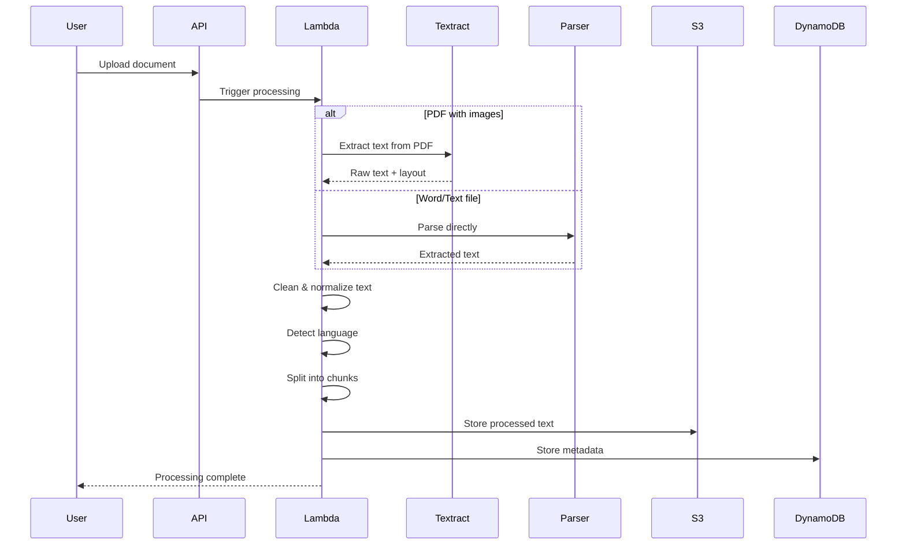
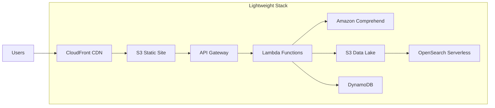
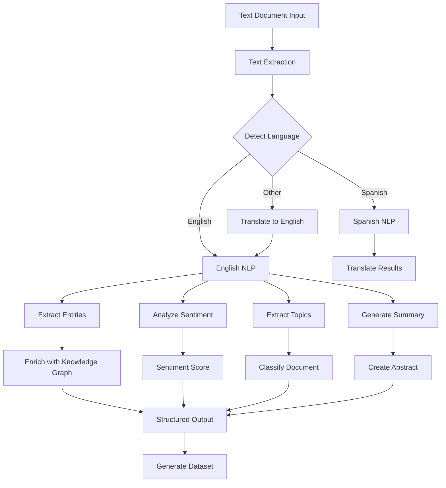
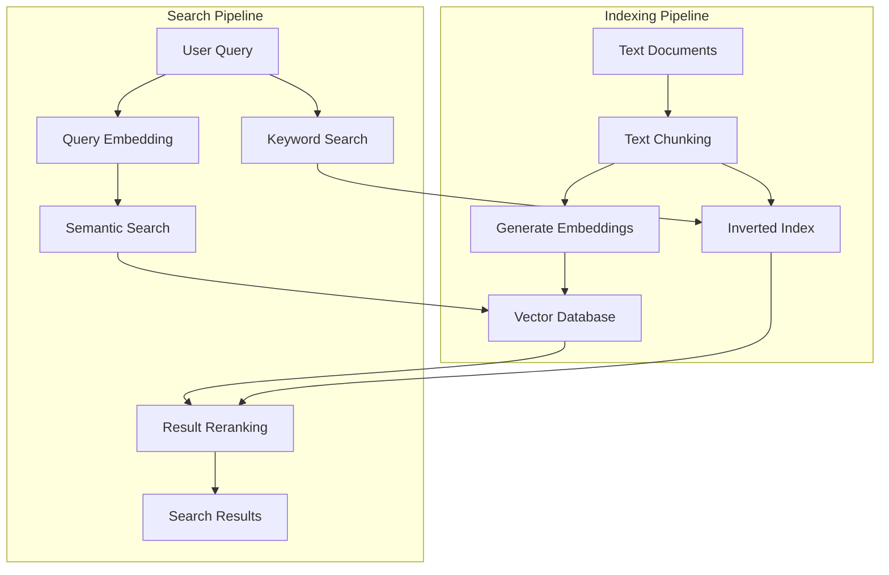
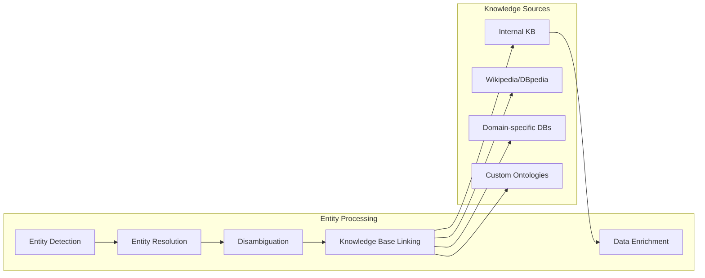
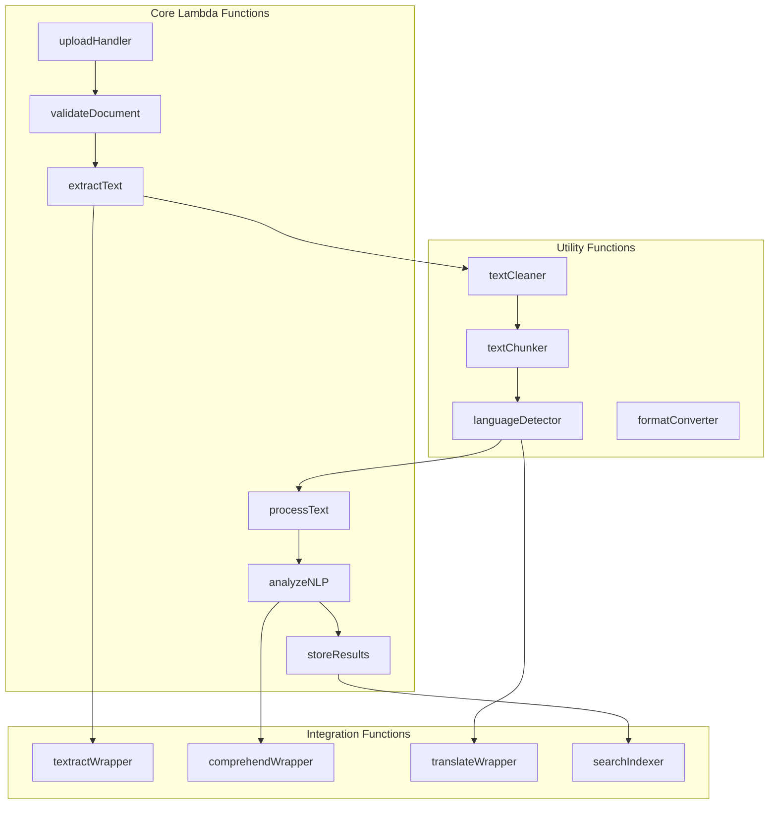
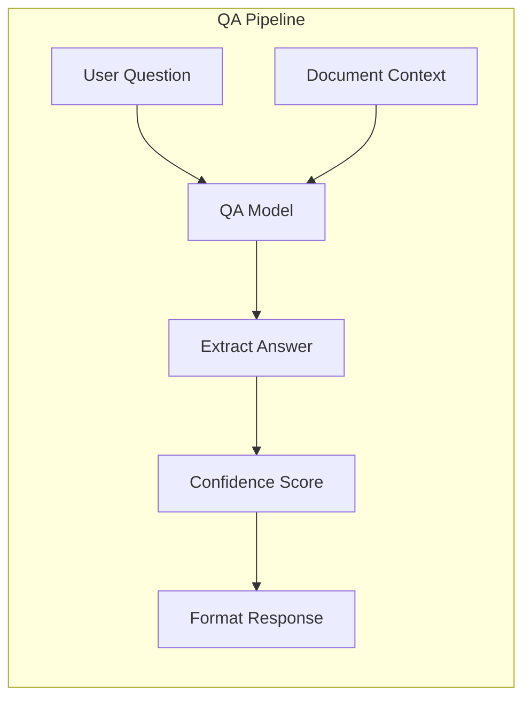
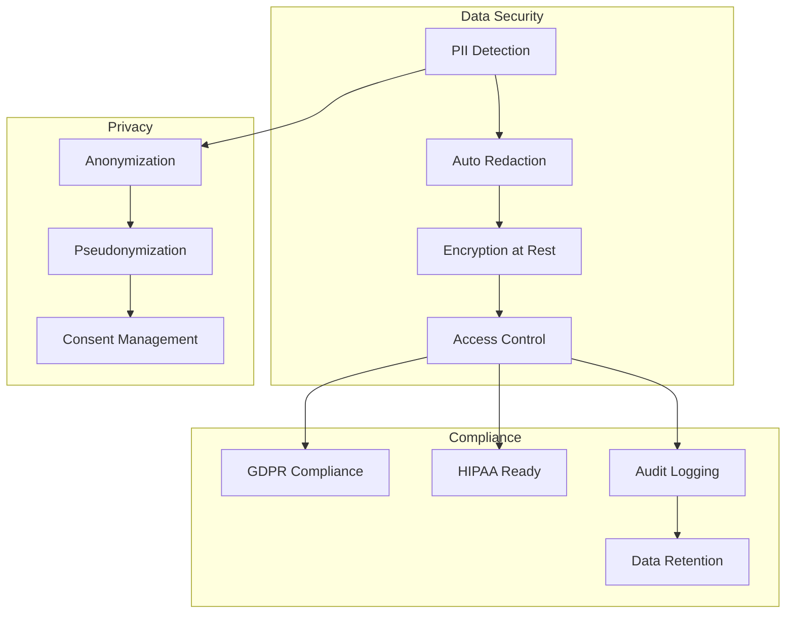

# Text Document Processing Platform - Specialized Architecture

## Executive Summary
A streamlined, cost-optimized AWS architecture specifically designed for processing text-based documents (PDF, Word, TXT, RTF, HTML, Markdown) with advanced NLP capabilities and intelligent text analytics.

## Architecture Overview

```mermaid
graph TB
    subgraph "Input Sources"
        PDFs[PDF Documents]
        Word[Word/Docs]
        Text[Plain Text]
        HTML[HTML/XML]
        Markdown[Markdown]
        Email[Email Files]
    end
    
    subgraph "Frontend"
        Upload[Upload Interface]
        TextEditor[Text Editor]
        Annotator[Annotation Tool]
        Analytics[Analytics Dashboard]
    end
    
    subgraph "API Layer"
        APIGW[API Gateway]
        GraphQL[AppSync GraphQL]
        WebSocket[WebSocket API]
    end
    
    subgraph "Text Processing Pipeline"
        Preprocessor[Text Preprocessor]
        OCR[OCR Engine]
        Parser[Document Parser]
        Cleaner[Text Cleaner]
        Normalizer[Normalizer]
    end
    
    subgraph "NLP Engine"
        Tokenizer[Tokenization]
        NER[Named Entity Recognition]
        Sentiment[Sentiment Analysis]
        Classification[Document Classification]
        Summarization[Text Summarization]
        KeyPhrases[Key Phrase Extraction]
    end
    
    subgraph "Advanced Analytics"
        TopicModeling[Topic Modeling]
        Clustering[Document Clustering]
        Similarity[Similarity Search]
        Translation[Multi-language Translation]
        QA[Question Answering]
    end
    
    subgraph "AWS AI Services"
        Textract[Amazon Textract]
        Comprehend[Amazon Comprehend]
        Translate[Amazon Translate]
        Kendra[Amazon Kendra]
        ComprehendMedical[Comprehend Medical]
    end
    
    subgraph "Storage & Search"
        S3[S3 Text Storage]
        DynamoDB[DynamoDB Metadata]
        OpenSearch[OpenSearch]
        VectorDB[Vector Database]
        Cache[ElastiCache]
    end
    
    subgraph "Output"
        Datasets[Structured Datasets]
        Reports[Analytics Reports]
        API[API Access]
        Export[Export Formats]
    end
    
    Input Sources --> Upload
    Upload --> APIGW
    APIGW --> Preprocessor
    
    Preprocessor --> OCR
    OCR --> Parser
    Parser --> Cleaner
    Cleaner --> Normalizer
    
    Normalizer --> Tokenizer
    Tokenizer --> NLP Engine
    NLP Engine --> Advanced Analytics
    
    NLP Engine --> AWS AI Services
    AWS AI Services --> Storage & Search
    
    Storage & Search --> Output
    Output --> Frontend
```

## Core Components

### 1. Text Extraction & Preprocessing



### 2. NLP Processing Pipeline

```yaml
NLPPipeline:
  Stage1_Preprocessing:
    Service: Lambda
    Functions:
      - Remove special characters
      - Fix encoding issues
      - Normalize whitespace
      - Detect & split sentences
      - Language detection
    Output: Clean text chunks
  
  Stage2_BasicNLP:
    Service: Comprehend
    Operations:
      - Tokenization
      - Part-of-speech tagging
      - Named Entity Recognition:
        - PERSON, ORGANIZATION, LOCATION
        - DATE, QUANTITY, MONEY
        - CUSTOM entities
      - Key phrase extraction
      - Syntax analysis
    Output: Annotated text
  
  Stage3_AdvancedAnalysis:
    Service: Lambda + Comprehend
    Features:
      - Sentiment analysis (document & sentence level)
      - Emotion detection
      - Document classification
      - Topic modeling (LDA)
      - Text summarization:
        - Extractive (key sentences)
        - Abstractive (AI-generated)
    Output: Analytics JSON
  
  Stage4_DomainSpecific:
    Service: Comprehend Custom/Medical
    Domains:
      Medical:
        - Medical entity extraction
        - ICD-10 coding
        - Drug interactions
      Legal:
        - Contract analysis
        - Clause extraction
        - Risk assessment
      Financial:
        - Financial entity detection
        - Compliance checking
        - Risk indicators
    Output: Domain insights
```

## Simplified Architecture for Text-Only



## Text Processing Workflows

### Workflow 1: Document Intelligence



### Workflow 2: Intelligent Text Search



## Specialized Text Processing Features

### 1. Smart Document Classification

```yaml
DocumentClassifier:
  PretrainedModels:
    - Industry: Legal, Medical, Financial, Technical
    - Type: Contract, Report, Article, Email
    - Sentiment: Positive, Negative, Neutral
    - Priority: Urgent, Normal, Low
  
  CustomModels:
    Training:
      Service: SageMaker
      Algorithm: BERT fine-tuning
      Data: User-labeled documents
    
    Deployment:
      Endpoint: SageMaker real-time
      Batch: SageMaker batch transform
      Edge: Lambda with ONNX
  
  Hierarchy:
    Level1: Main category (Legal, Medical, etc.)
    Level2: Subcategory (Contract, Patent, etc.)
    Level3: Specific type (NDA, License, etc.)
```

### 2. Entity Resolution & Linking



### 3. Multi-document Analysis

```yaml
MultiDocumentAnalysis:
  CrossDocumentFeatures:
    - Duplicate detection
    - Contradiction identification
    - Timeline extraction
    - Relationship mapping
    - Trend analysis
  
  Implementation:
    DuplicateDetection:
      Service: Lambda
      Method: MinHash + LSH
      Threshold: 0.8 similarity
    
    ContradictionDetection:
      Service: SageMaker
      Model: BERT-based NLI
      Output: Contradiction pairs
    
    TimelineExtraction:
      Service: Comprehend + Lambda
      Features:
        - Temporal entity extraction
        - Event ordering
        - Duration calculation
    
    RelationshipMapping:
      Service: Neptune
      Storage: Graph database
      Visualization: D3.js
```

## Text-Specific UI Components

### Document Upload & Processing Interface

```
┌────────────────────────────────────────────────────────┐
│              Text Document Processor                   │
├────────────────────────────────────────────────────────┤
│                                                         │
│  Upload Documents:                                     │
│  ┌──────────────────────────────────────────────┐     │
│  │ 📄 contract_2024.pdf         (uploading 67%) │     │
│  │ 📄 report_q4.docx           ✓ processed      │     │
│  │ 📄 emails_batch.mbox        ⏳ queued         │     │
│  │ 📄 notes.txt                ✓ processed      │     │
│  │                                              │     │
│  │ + Add more files or drag & drop here         │     │
│  └──────────────────────────────────────────────┘     │
│                                                         │
│  Processing Options:                                   │
│  ┌──────────────────────────────────────────────┐     │
│  │ Language:     [Auto-detect ▼]                │     │
│  │ Analysis:                                    │     │
│  │   ☑ Named Entity Recognition                 │     │
│  │   ☑ Sentiment Analysis                       │     │
│  │   ☑ Key Phrase Extraction                    │     │
│  │   ☑ Document Classification                  │     │
│  │   ☑ Summarization (250 words)                │     │
│  │   ☐ Topic Modeling                           │     │
│  │   ☐ Medical Entity Extraction                │     │
│  │                                              │     │
│  │ Output Format:                               │     │
│  │   ○ JSON (structured)                        │     │
│  │   ● CSV (tabular)                            │     │
│  │   ○ Knowledge Graph (RDF)                    │     │
│  └──────────────────────────────────────────────┘     │
│                                                         │
│  [Process Documents]  [Save as Template]               │
│                                                         │
└────────────────────────────────────────────────────────┘
```

### Text Analytics Dashboard

```
┌────────────────────────────────────────────────────────┐
│           Document Analytics Dashboard                 │
├────────────────────────────────────────────────────────┤
│                                                         │
│  Document: contract_2024.pdf                           │
│  Processed: 2024-01-16 10:45:23                       │
│                                                         │
│  ┌─────────────────┬────────────────────────────┐     │
│  │ Key Metrics     │ Visualization              │     │
│  ├─────────────────┼────────────────────────────┤     │
│  │ Words: 12,456   │ Sentiment Over Document:   │     │
│  │ Sentences: 523  │ ▂▄█▆▄▂▄▆████▆▄▂▄▆█       │     │
│  │ Paragraphs: 47  │ Negative ← → Positive      │     │
│  │ Read Time: 48m  │                            │     │
│  │                 │ Top Entities:              │     │
│  │ Overall:        │ • Acme Corp (43)           │     │
│  │ Sentiment: +0.7 │ • John Smith (12)          │     │
│  │ Complexity: Med │ • $2.5M (8)                │     │
│  │ Category: Legal │ • 2024-12-31 (6)           │     │
│  └─────────────────┴────────────────────────────┘     │
│                                                         │
│  Key Phrases:                                          │
│  ┌──────────────────────────────────────────────┐     │
│  │ • "service level agreement" (15)             │     │
│  │ • "intellectual property" (12)               │     │
│  │ • "termination clause" (8)                   │     │
│  │ • "confidential information" (7)             │     │
│  └──────────────────────────────────────────────┘     │
│                                                         │
│  Summary:                                               │
│  ┌──────────────────────────────────────────────┐     │
│  │ This service agreement establishes terms     │     │
│  │ between Acme Corp and Beta Inc for cloud    │     │
│  │ services. Key provisions include 99.9% SLA,  │     │
│  │ monthly payment terms, and IP ownership...   │     │
│  └──────────────────────────────────────────────┘     │
│                                                         │
│  [Export Results] [View Full Text] [Compare Docs]      │
│                                                         │
└────────────────────────────────────────────────────────┘
```

## Optimized Cost Structure for Text Processing

```yaml
CostOptimization:
  Tier1_Basic:
    # <10,000 pages/month
    Services:
      - Lambda: 256MB functions
      - Comprehend: Batch APIs
      - S3: Standard storage
      - DynamoDB: On-demand
    Cost: ~$50-100/month
  
  Tier2_Standard:
    # 10,000-100,000 pages/month
    Services:
      - Lambda: 512MB with provisioned concurrency
      - Comprehend: Batch + real-time mix
      - S3: Intelligent-Tiering
      - OpenSearch: t3.small cluster
    Cost: ~$200-500/month
  
  Tier3_Enterprise:
    # >100,000 pages/month
    Services:
      - Lambda: 1GB+ with reserved concurrency
      - Comprehend: Custom endpoints
      - S3: Intelligent-Tiering + Glacier
      - OpenSearch: Production cluster
      - SageMaker: Custom models
    Cost: ~$1000-5000/month

APICallOptimization:
  Strategies:
    Batching:
      - Group documents for Comprehend batch API
      - Process up to 25 documents per call
      - 60% cost reduction vs real-time
    
    Caching:
      - Cache NLP results in DynamoDB
      - 90-day TTL for static documents
      - 40% reduction in API calls
    
    Selective Processing:
      - Skip NLP for simple text extraction
      - Use regex for simple pattern matching
      - Reserve AI for complex analysis
```

## Lambda Functions Architecture



## Performance Metrics

```yaml
PerformanceTargets:
  TextExtraction:
    PDF_1MB: < 2 seconds
    Word_5MB: < 3 seconds
    Text_10MB: < 1 second
  
  NLPProcessing:
    Entities_1000words: < 500ms
    Sentiment_1000words: < 300ms
    Summary_5000words: < 2 seconds
    Classification: < 200ms
  
  EndToEnd:
    Small_Doc_1-10pages: < 5 seconds
    Medium_Doc_10-50pages: < 20 seconds
    Large_Doc_50-200pages: < 60 seconds
  
  Accuracy:
    OCR_Accuracy: > 98%
    Entity_Precision: > 90%
    Sentiment_Accuracy: > 85%
    Classification_F1: > 0.9
```

## Advanced Text Features

### 1. Smart Summarization

```yaml
Summarization:
  Types:
    Extractive:
      Method: TextRank algorithm
      Output: Key sentences from original
      Speed: Fast (<1s)
      Use: Quick overview
    
    Abstractive:
      Method: BART/T5 model
      Output: AI-generated summary
      Speed: Moderate (2-5s)
      Use: Human-like summary
    
    Hybrid:
      Method: Extract + refine
      Output: Enhanced key sentences
      Speed: Moderate (1-3s)
      Use: Balanced approach
  
  LengthOptions:
    Bullet_Points: 3-5 points
    Brief: 50-100 words
    Standard: 200-300 words
    Detailed: 500+ words
```

### 2. Question Answering System



### 3. Document Comparison

```yaml
DocumentComparison:
  Features:
    - Text similarity (cosine, Jaccard)
    - Semantic similarity (embeddings)
    - Structure comparison
    - Entity overlap
    - Topic divergence
    - Version tracking
  
  Output:
    SimilarityScore: 0-100%
    AddedContent: Highlighted text
    DeletedContent: Strikethrough text
    ModifiedContent: Track changes
    EntityChanges: Table format
```

## Security & Compliance for Text



## Implementation Roadmap

### Phase 1: Core Text Processing (Week 1-2)
- Basic text extraction (PDF, Word, TXT)
- Language detection
- Simple NLP (entities, sentiment)
- Storage setup

### Phase 2: Advanced NLP (Week 3-4)
- Document classification
- Summarization
- Key phrase extraction
- Topic modeling

### Phase 3: Search & Analytics (Week 5-6)
- OpenSearch integration
- Semantic search
- Analytics dashboard
- Export capabilities

### Phase 4: Specialized Features (Week 7-8)
- Domain-specific models
- Multi-document analysis
- QA system
- API development

---

**Document Version**: 1.0  
**Focus**: Text-only document processing with advanced NLP  
**Cost Range**: $50-5000/month based on volume  
**Processing Speed**: 5-60 seconds per document  
**Last Updated**: 2025-09-16