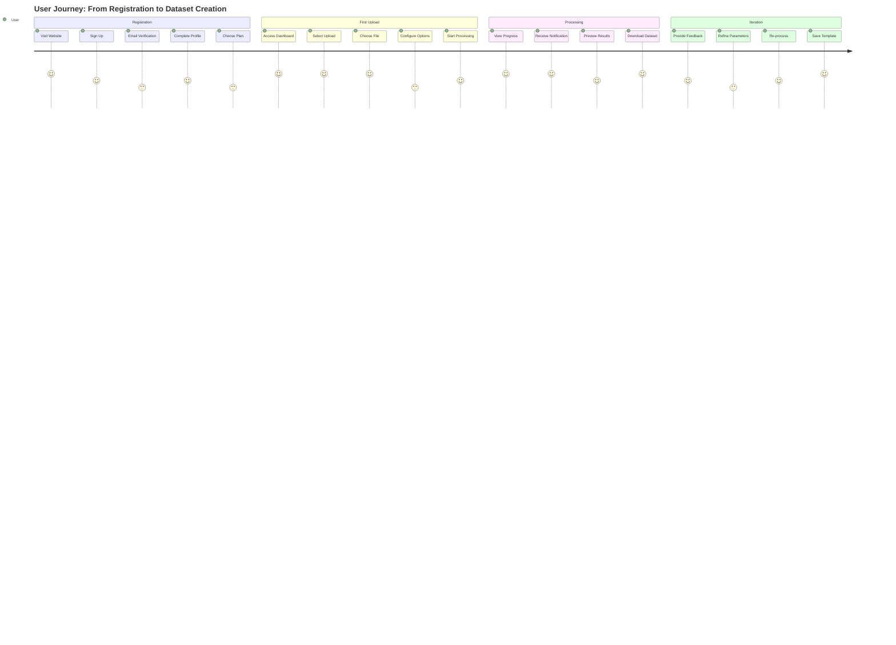
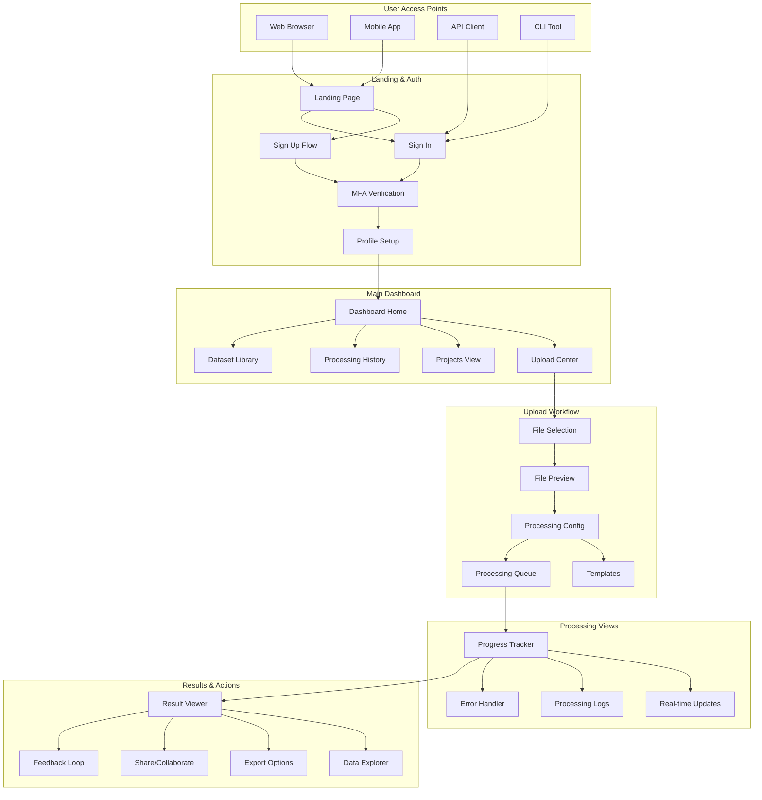
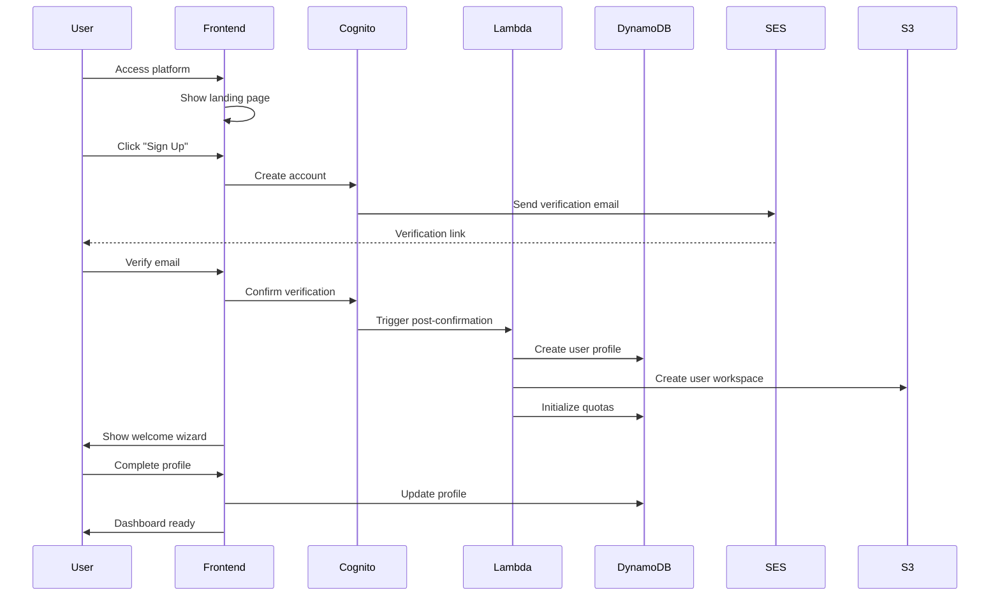
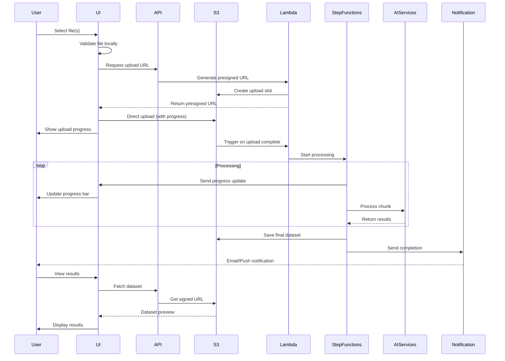
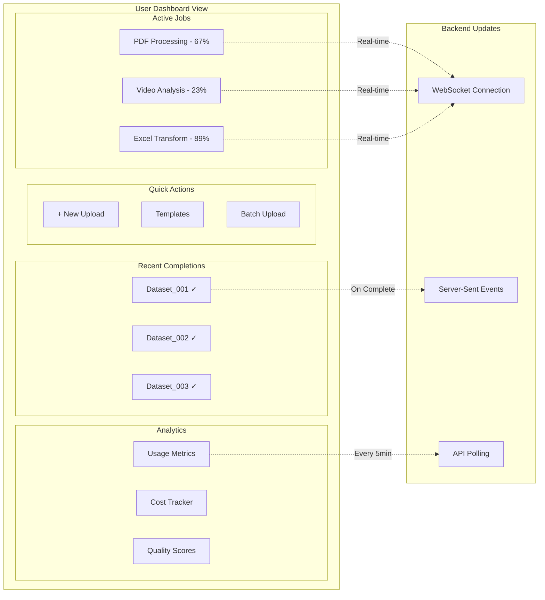
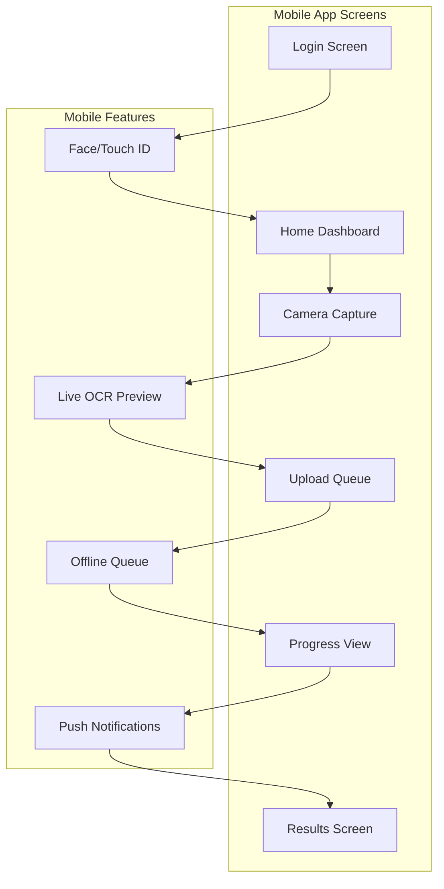
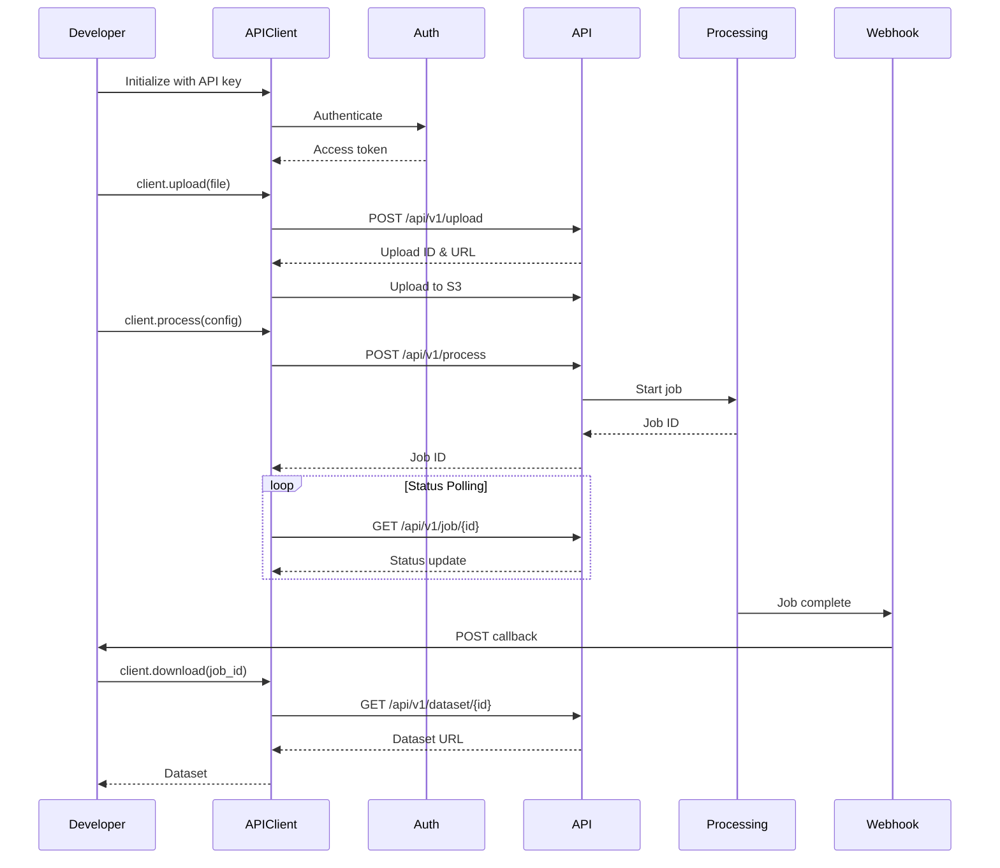
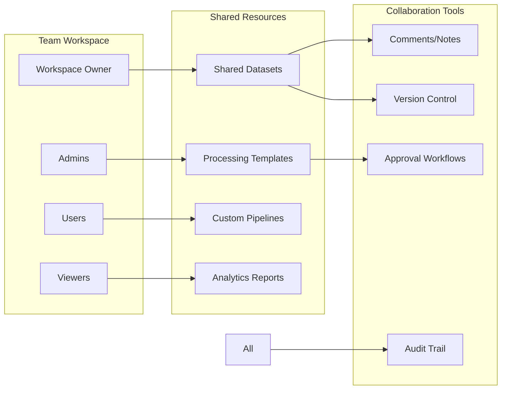
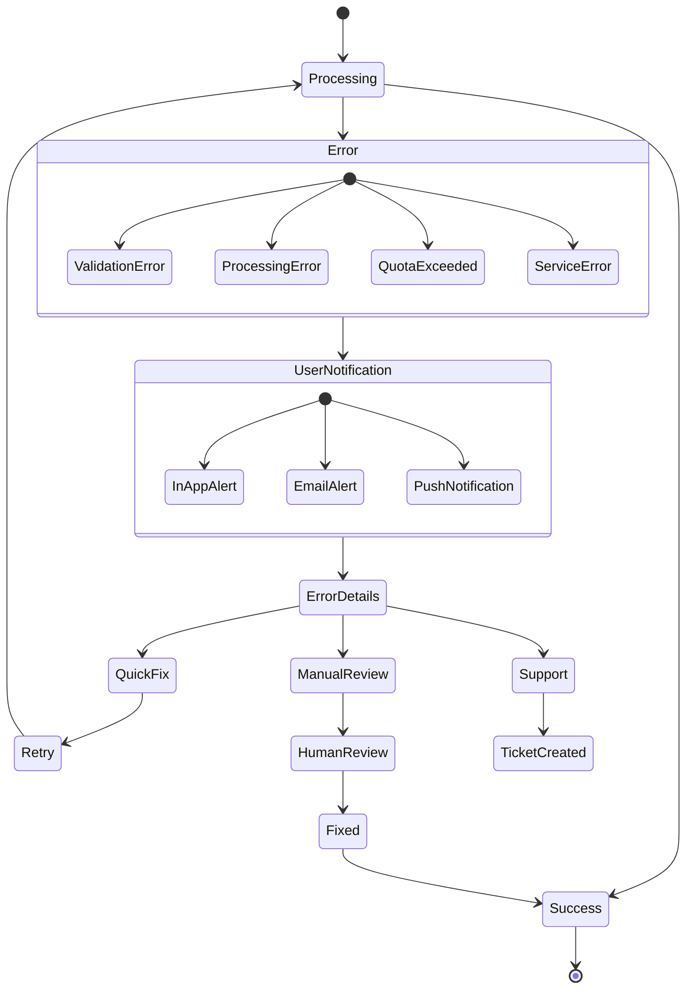
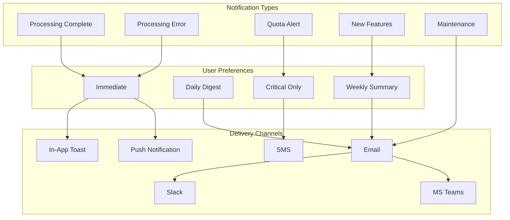

# User Journey & Experience Architecture

## Complete User Interaction Flow



## User Interface Architecture



## Detailed User Workflows

### 1. New User Onboarding Flow



### 2. File Upload & Processing Flow



### 3. Real-time Monitoring Dashboard



## User Interface Components

### 4. Upload Center Interface

```
┌────────────────────────────────────────────────────────┐
│                    Upload Center                       │
├────────────────────────────────────────────────────────┤
│                                                         │
│  ┌──────────────────────────────────────────────┐     │
│  │                                              │     │
│  │     Drag & Drop Files Here                   │     │
│  │           or Click to Browse                 │     │
│  │                                              │     │
│  │     Supported: PDF, Word, Excel, CSV,        │     │
│  │     Audio (MP3, WAV), Video (MP4, AVI)      │     │
│  │                                              │     │
│  └──────────────────────────────────────────────┘     │
│                                                         │
│  Selected Files:                                       │
│  ┌──────────────────────────────────────────────┐     │
│  │ ✓ invoice_2024.pdf          (2.3 MB)        │     │
│  │ ✓ customer_data.xlsx        (15.7 MB)       │     │
│  │ ✓ meeting_recording.mp3     (45.2 MB)       │     │
│  └──────────────────────────────────────────────┘     │
│                                                         │
│  Processing Options:                                   │
│  ┌──────────────────────────────────────────────┐     │
│  │ Output Format:  [CSV ▼]                      │     │
│  │ Quality:        [Balanced ▼]                 │     │
│  │ Language:       [Auto-detect ▼]              │     │
│  │ ☑ Extract tables from PDFs                   │     │
│  │ ☑ Transcribe audio content                   │     │
│  │ ☐ Include metadata                           │     │
│  │ ☑ Apply data validation                      │     │
│  └──────────────────────────────────────────────┘     │
│                                                         │
│  [Use Template ▼]  [Save as Template]  [Process Now]   │
│                                                         │
└────────────────────────────────────────────────────────┘
```

### 5. Processing Progress View

```
┌────────────────────────────────────────────────────────┐
│              Processing Your Files                     │
├────────────────────────────────────────────────────────┤
│                                                         │
│  invoice_2024.pdf                                      │
│  ┌──────────────────────────────────────────────┐     │
│  │████████████████████░░░░░░░░░│ 67%            │     │
│  └──────────────────────────────────────────────┘     │
│  Stage: Extracting tables with Amazon Textract         │
│  Time elapsed: 00:02:34 | Est. remaining: 00:01:12    │
│                                                         │
│  customer_data.xlsx                                    │
│  ┌──────────────────────────────────────────────┐     │
│  │██████████████████████████░░░│ 89%            │     │
│  └──────────────────────────────────────────────┘     │
│  Stage: Validating and transforming data               │
│  Time elapsed: 00:01:45 | Est. remaining: 00:00:15    │
│                                                         │
│  meeting_recording.mp3                                 │
│  ┌──────────────────────────────────────────────┐     │
│  │████████░░░░░░░░░░░░░░░░░░░░│ 23%            │     │
│  └──────────────────────────────────────────────┘     │
│  Stage: Transcribing audio with Amazon Transcribe      │
│  Time elapsed: 00:03:12 | Est. remaining: 00:10:45    │
│                                                         │
│  Processing Log:                                       │
│  ┌──────────────────────────────────────────────┐     │
│  │ [10:23:45] Upload completed                   │     │
│  │ [10:23:46] Files validated successfully       │     │
│  │ [10:23:47] Processing started                 │     │
│  │ [10:24:12] Text extraction: 100% complete     │     │
│  │ [10:25:03] Table detection: 3 tables found    │     │
│  └──────────────────────────────────────────────┘     │
│                                                         │
│  [Pause]  [Cancel]  [Run in Background]                │
│                                                         │
└────────────────────────────────────────────────────────┘
```

### 6. Results & Dataset Explorer

```
┌────────────────────────────────────────────────────────┐
│            Dataset Explorer - DS_20240116_001          │
├────────────────────────────────────────────────────────┤
│                                                         │
│  Summary:                                              │
│  • Total Records: 1,247                                │
│  • Columns: 23                                         │
│  • Processing Time: 4m 32s                             │
│  • Quality Score: 94/100                               │
│                                                         │
│  Preview:                                              │
│  ┌──────────────────────────────────────────────┐     │
│  │ ID  │ Name        │ Date       │ Amount    │     │
│  ├─────┼─────────────┼────────────┼───────────┤     │
│  │ 001 │ John Doe    │ 2024-01-15 │ $1,234.56 │     │
│  │ 002 │ Jane Smith  │ 2024-01-15 │ $2,345.67 │     │
│  │ 003 │ Bob Johnson │ 2024-01-14 │ $3,456.78 │     │
│  │ ... │ ...         │ ...        │ ...       │     │
│  └──────────────────────────────────────────────┘     │
│                                                         │
│  Data Quality:                                         │
│  • Completeness: ████████████████░░ 95%               │
│  • Accuracy:     █████████████████░ 97%               │
│  • Consistency:  ████████████████░░ 92%               │
│                                                         │
│  Detected Issues:                                      │
│  ⚠ 3 duplicate entries found (rows 45, 67, 89)        │
│  ⚠ 12 missing values in 'Phone' column                │
│  ✓ All dates properly formatted                        │
│  ✓ No PII detected in public fields                   │
│                                                         │
│  Actions:                                              │
│  [Download CSV] [Download JSON] [Download Parquet]     │
│  [Share] [Create API] [Schedule Refresh] [Reprocess]   │
│                                                         │
└────────────────────────────────────────────────────────┘
```

## Mobile Application Flow



## API Client Integration Flow



## User Collaboration Features



## User Analytics Dashboard

```
┌────────────────────────────────────────────────────────┐
│                 Analytics Dashboard                    │
├────────────────────────────────────────────────────────┤
│                                                         │
│  Usage This Month:                                     │
│  ┌──────────────────────────────────────────────┐     │
│  │     Files Processed: 347                     │     │
│  │     Data Volume: 23.7 GB                     │     │
│  │     API Calls: 1,247                         │     │
│  │     Success Rate: 98.3%                      │     │
│  └──────────────────────────────────────────────┘     │
│                                                         │
│  Processing Trends:                                    │
│  ┌──────────────────────────────────────────────┐     │
│  │     📊 Daily Processing Volume               │     │
│  │     ▁▃▅█▇▅▃▅▇████▇▅▃▁▃▅▇█              │     │
│  │     1  5  10  15  20  25  30 (days)       │     │
│  └──────────────────────────────────────────────┘     │
│                                                         │
│  File Type Distribution:                               │
│  ┌──────────────────────────────────────────────┐     │
│  │ PDF      ████████████████ 45%              │     │
│  │ Excel    ████████████ 30%                  │     │
│  │ CSV      ████████ 20%                      │     │
│  │ Audio    ██ 5%                              │     │
│  └──────────────────────────────────────────────┘     │
│                                                         │
│  Cost Breakdown:                                       │
│  ┌──────────────────────────────────────────────┐     │
│  │ Storage         $12.34  ████                │     │
│  │ Processing      $45.67  ████████████        │     │
│  │ AI Services     $89.12  ████████████████    │     │
│  │ Data Transfer   $5.43   ██                  │     │
│  │                                              │     │
│  │ Total: $152.56  (72% of monthly budget)     │     │
│  └──────────────────────────────────────────────┘     │
│                                                         │
└────────────────────────────────────────────────────────┘
```

## Error Handling & User Feedback



## User Onboarding Wizard

```
┌────────────────────────────────────────────────────────┐
│          Welcome to Data Processing Platform!          │
├────────────────────────────────────────────────────────┤
│                                                         │
│  Step 1 of 4: Choose Your Use Case                     │
│                                                         │
│  ○ Document Processing & OCR                           │
│     Extract text and tables from PDFs and images       │
│                                                         │
│  ○ Data Transformation & ETL                           │
│     Convert and clean Excel, CSV, and database files   │
│                                                         │
│  ● Media Transcription & Analysis                      │
│     Convert audio/video to text with insights          │
│                                                         │
│  ○ Custom ML Pipeline                                  │
│     Build your own processing workflow                 │
│                                                         │
│  [Back]                           [Next: Sample Upload] │
└────────────────────────────────────────────────────────┘
                            ↓
┌────────────────────────────────────────────────────────┐
│  Step 2 of 4: Try a Sample Upload                      │
├────────────────────────────────────────────────────────┤
│                                                         │
│  Let's process your first file!                        │
│                                                         │
│  [📎 Upload Sample File]  or  [Use Demo File]          │
│                                                         │
│  ┌──────────────────────────────────────────────┐     │
│  │ Demo: podcast_episode.mp3                    │     │
│  │ We'll transcribe this audio file and         │     │
│  │ extract key topics and sentiments.           │     │
│  └──────────────────────────────────────────────┘     │
│                                                         │
│  [Back]                            [Start Processing]   │
└────────────────────────────────────────────────────────┘
```

## User Settings & Preferences

```
┌────────────────────────────────────────────────────────┐
│                    User Settings                       │
├────────────────────────────────────────────────────────┤
│                                                         │
│  Profile                                                │
│  ├─ Name: John Doe                                     │
│  ├─ Email: john@company.com                            │
│  └─ Role: Data Analyst                                 │
│                                                         │
│  Processing Defaults                                    │
│  ├─ Output Format:        [CSV ▼]                      │
│  ├─ Quality Level:        [High ▼]                     │
│  ├─ Auto-retry on error:  [✓]                          │
│  └─ Email notifications:  [✓]                          │
│                                                         │
│  API Configuration                                      │
│  ├─ API Key: ****-****-****-7a8b [Regenerate]         │
│  ├─ Webhook URL: https://company.com/webhook           │
│  └─ Rate Limit: 1000 req/hour                         │
│                                                         │
│  Data Retention                                         │
│  ├─ Keep processed files: [30 days ▼]                  │
│  ├─ Keep datasets:        [90 days ▼]                  │
│  └─ Auto-archive:         [✓]                          │
│                                                         │
│  [Save Changes]  [Cancel]                               │
└────────────────────────────────────────────────────────┘
```

## Notification System



---

**Document Version**: 1.0  
**Purpose**: User Journey & Experience Design  
**Target Audience**: Development Team, UX Designers, Product Managers  
**Last Updated**: 2025-09-16